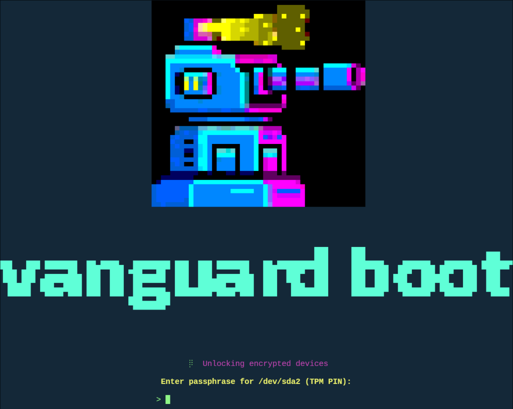

<p align="center">
  
</p>

# Vanguard

A minimal, security-focused initramfs generator for Linux systems with full disk encryption. Written in Go, Vanguard creates lightweight boot images optimized for LUKS + LVM + TPM2 setups.

## Features

- **Full Disk Encryption** - LUKS2 with TPM2 automatic unlock via systemd-cryptenroll
- **TPM2 Integration** - Automatic token detection, PIN support, PCRLock policy binding
- **LVM Support** - Full LVM2 volume group and logical volume activation
- **GPT Autodiscovery** - Automatic root partition detection using Discoverable Partitions Specification
- **Hibernate/Resume** - Support for resuming from encrypted swap (inside LUKS+LVM)
- **Filesystem Check** - Optional fsck before mounting root
- **Vconsole Support** - Keyboard layout and console font configuration for password prompts
- **Minimal Footprint** - Only includes binaries and modules needed for your configuration
- **Fast Boot** - zstd compression, parallel device scanning
- **Self-contained** - CLI embeds pre-built init binaries

## Screens

<p align="center">
  
</p>


## Quick Start

```bash
# Build from source
git clone https://github.com/zaolin/vanguard
cd vanguard
make

# Generate initramfs
sudo ./vanguard generate -o /boot/initramfs-linux.img

# With debug output enabled
sudo ./vanguard generate -o /boot/initramfs-linux.img --debug
```

## Documentation

| Document | Description |
|----------|-------------|
| [Boot Flow](docs/boot-flow.md) | Detailed initramfs boot sequence |
| [Configuration](docs/configuration.md) | CLI options and config file format |
| [TPM2 Setup](docs/tpm2-setup.md) | TPM2 enrollment and PCRLock guide |
| [Kernel Parameters](docs/kernel-parameters.md) | Supported kernel command line options |

## Commands

### generate

Generate an initramfs image:

```bash
vanguard generate -o /boot/initramfs-linux.img [options]
```

| Option | Description |
|--------|-------------|
| `-o, --output` | Output path (required) |
| `-f, --firmware` | Comma-separated firmware files |
| `-m, --modules` | Comma-separated kernel modules |
| `-c, --compression` | `zstd`, `gzip`, or `none` (default: zstd) |
| `-d, --debug` | Enable verbose boot output |
| `--config` | Path to TOML config file |

### update-tpm-policy

Update TPM2 PCRLock policy for secure boot:

```bash
vanguard update-tpm-policy -u /boot/EFI/Linux/kernel.efi [options]
```

| Option | Description |
|--------|-------------|
| `-u, --uki-path` | Path to UKI file (required) |
| `-p, --policy-output` | Output path for policy JSON |
| `--luks-device` | LUKS device for token verification |
| `--no-verify` | Skip policy verification |

## Configuration File

Create `/etc/vanguard.toml`:

```toml
output = "/boot/initramfs-linux.img"
compression = "zstd"
debug = false

firmware = [
    "amd/amd_sev.fw",
    "amdgpu/vangogh_sos.bin",
]

modules = [
    "nvme",
    "xhci_pci",
]
```

## Typical Setup

### 1. Partition Layout

```
/dev/sda
├── /dev/sda1  ESP (FAT32, ~512MB)     - EFI System Partition
└── /dev/sda2  LUKS encrypted          - Contains LVM
    └── LVM PV
        └── VG: vg0
            ├── LV: root (ext4/xfs)
            └── LV: swap
```

### 2. Enroll TPM2

```bash
# Basic enrollment
systemd-cryptenroll --tpm2-device=auto /dev/sda2

# With PIN
systemd-cryptenroll --tpm2-device=auto --tpm2-with-pin=yes /dev/sda2

# With PCRLock policy
vanguard update-tpm-policy -u /boot/EFI/Linux/kernel.efi
systemd-cryptenroll --tpm2-device=auto --tpm2-pcrlock=/boot/pcrlock.json /dev/sda2
```

### 3. Generate Initramfs

```bash
vanguard generate -o /boot/initramfs-linux.img
```

### 4. Kernel Command Line

```
root=/dev/vg0/root resume=/dev/vg0/swap
```

See [docs/kernel-parameters.md](docs/kernel-parameters.md) for all supported parameters.

## Boot Sequence Overview

```
┌─────────────────────────────────────────────────────────────┐
│  1. Console Setup          Set up early console I/O        │
│  2. Mount Filesystems      /proc, /sys, /dev, /run         │
│  3. Vconsole Config        Load keyboard layout/font       │
│  4. Mount /boot            Mount boot partition for policy │
│  5. Init Boot Log          Start logging to /boot          │
│  6. Start udevd            Device discovery daemon         │
│  7. Load Modules           Kernel modules from image       │
│  8. Load TPM Modules       tpm_crb, tpm_tis, tpm_tis_core  │
│  9. Setup PCRLock          Copy pcrlock.json for TPM2      │
│ 10. Unlock LUKS            TPM2 → PIN → Passphrase         │
│ 11. Activate LVM           Scan and activate volumes       │
│ 12. Try Resume             Hibernate resume from swap      │
│ 13. fsck                   Check root filesystem           │
│ 14. Mount Root             Mount to /sysroot               │
│ 15. Switch Root            Hand off to init                │
└─────────────────────────────────────────────────────────────┘
```

See [docs/boot-flow.md](docs/boot-flow.md) for detailed documentation.

## Requirements

**Build Requirements:**
- Go 1.21+
- make

**Runtime Dependencies (included in initramfs):**
- cryptsetup
- lvm2
- systemd-udevd
- tpm2-tools (optional, for PCR debugging)

## Testing

```bash
# Run QEMU test with software TPM
./scripts/qemu-test.sh all-tpm

# Individual steps
./scripts/qemu-test.sh build       # Build initramfs
./scripts/qemu-test.sh disk        # Create test disk
./scripts/qemu-test.sh enroll-tpm  # Enroll TPM2 token
./scripts/qemu-test.sh tpm         # Boot with TPM
```

## Security Features

- TPM2 sealed keys with PCR policy binding (PCR 4 for UKI, PCR 7 for Secure Boot)
- PCRLock for predictable boot measurement validation
- PIN protection for TPM2 tokens
- Passphrase fallback when TPM2 fails (3 attempts before halt)
- Kernel message suppression during password entry
- Static Go binary init (no dynamic linking vulnerabilities in init)
- Minimal attack surface (only essential binaries included)
- Boot logging to `/boot/.vanguard.log` for audit trail

## License

MIT License - see [LICENSE](LICENSE) for details.

## Contributing

Contributions welcome! Please open an issue or pull request on GitHub.
