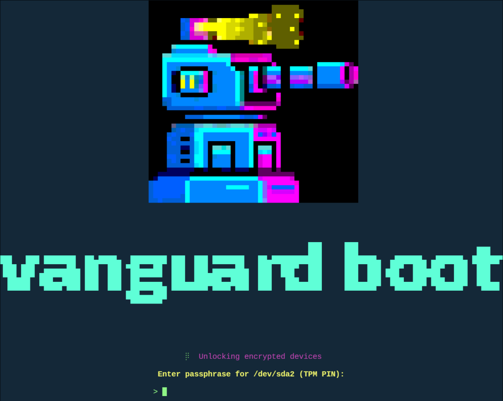

<p align="center">
  
</p>

# Vanguard

A minimal, security-focused initramfs generator for Linux systems with full disk encryption. Written in Go, Vanguard creates lightweight boot images optimized for LUKS + LVM + TPM2 setups with PCRLock boot integrity enforcement.

## Features

- **Full Disk Encryption** — LUKS2 with TPM2 automatic unlock via systemd-cryptenroll
- **Native Go TPM2** — Zero external dependencies; uses `google/go-tpm` for sealed key unseal with traditional PCR policy and PolicyAuthorizeNV (pcrlock)
- **Native Go LUKS** — LUKS v1/v2 header parsing, Argon2/PBKDF2 key derivation, and dm-crypt mapper setup via ioctl — no libcryptsetup required at runtime
- **TPM2 Integration** — Automatic token detection, PIN support, PCRLock policy binding with multi-branch PCR prediction (PolicyOR) for the LUKS token. TOTP recovery seed sealed to PCR 7 (Secure Boot state) with single-branch PolicyPCR — automatically re-provisioned after firmware updates via `--auto-reseed`
- **TOTP Recovery** — Time-based one-time password recovery for strict mode; scan a QR code with your authenticator app to enable passphrase fallback when TPM unseal fails
- **Strict Mode** — Always-on; disables passphrase fallback when TPM2 token is present. TOTP recovery provides secure fallback without weakening the threat model
- **LVM Support** — Full LVM2 volume group and logical volume activation with persistent symlinks across switch_root
- **Non-Root Filesystem Mounting** — Mounts `/home` and other non-root filesystems from fstab before switch_root, bypassing udev database corruption issues
- **Boot TUI** — Bubble Tea-based terminal UI with spinner, stage progress, and password/PIN prompts during boot
- **GPT Autodiscovery** — Automatic root partition detection using Discoverable Partitions Specification
- **Hibernate/Resume** — Support for resuming from encrypted swap (inside LUKS+LVM)
- **Filesystem Check** — Optional fsck before mounting root
- **Vconsole Support** — Keyboard layout and console font configuration for password prompts
- **Minimal Footprint** — Only includes binaries and modules needed for your configuration
- **Fast Boot** — zstd compression, parallel device scanning
- **Self-contained** — CLI embeds pre-built init binaries; no CGo in init

## Screens

<p align="center">
  
</p>

## Quick Start

```bash
# Build from source
git clone https://github.com/zaolin/vanguard
cd vanguard
make

# Check system protection status
sudo ./vanguard status

# Generate initramfs (strict mode is always-on — TOTP recovery required for passphrase fallback)
sudo ./vanguard generate -o /boot/initramfs-linux.img

# With debug output enabled
sudo ./vanguard generate -o /boot/initramfs-linux.img --debug
```

## Documentation

| Document | Description |
|----------|-------------|
| [Boot Flow](docs/boot-flow.md) | Detailed initramfs boot sequence |
| [Configuration](docs/configuration.md) | CLI options and config file format |
| [TPM2 Setup](docs/tpm2-setup.md) | TPM2 enrollment and PCRLock guide |
| [Kernel Parameters](docs/kernel-parameters.md) | Supported kernel command line options |

## Commands

### generate

Generate an initramfs image:

```bash
vanguard generate -o /boot/initramfs-linux.img [options]
```

| Option | Description |
|--------|-------------|
| `-o, --output` | Output path (required) |
| `-f, --firmware` | Comma-separated firmware files |
| `-m, --modules` | Comma-separated kernel modules |
| `-c, --compression` | `zstd`, `gzip`, or `none` (default: zstd) |
| `-d, --debug` | Enable verbose boot output |
| `--config` | Path to TOML config file |

### update

Update TPM2 PCRLock policy for secure boot:

```bash
vanguard update -u /boot/EFI/Gentoo/kernel.efi [options]
```

| Option | Description |
|--------|--------|
| `-u, --uki-path` | Path to UKI file (required) |
| `-p, --policy-output` | Output path for policy JSON (default: `<uki-path>.pcrlock.json`) |
| `-l, --luks-device` | LUKS device for token verification (enables GPT binding on PCR 5) |
| `--no-gpt` | Disable GPT partition table binding (PCR 5) |
| `--no-verify` | Skip policy verification |
| `-v, --verbose` | Show verbose output from pcrlock tools |
| `-c, --cleanup` | Remove old unused pcrlock NV indices from TPM |

**What it does:**

1. **Configure masks** — Masks noisy/unpredictable PCR components (firmware code/config, OS separator, NV-PCR separator, machine ID, root filesystem, shutdown, final). These systemd-specific components expect userspace PCR measurements that vanguard's custom init does not produce; unmasked they cause `systemd-pcrlock make-policy` to drop all PCRs from the protection mask.
2. **Regenerate firmware components** — Runs `systemd-pcrlock lock-firmware-code` and `lock-firmware-config` (or the Varlink `Lock` method on systemd 262+) to refresh stale `/var/lib/pcrlock.d/250-firmware-*-early.pcrlock.d/generated.pcrlock` files from the current boot's event log. Without this, stale firmware components cause a cascade that drops all PCRs including PCR 7.
3. **Lock Secure Boot** — Runs `lock-secureboot-policy` + `lock-secureboot-authority` (or Varlink `Lock`) to generate PCR 7 component files from current Secure Boot state.
4. **Lock GPT** (with `-l`) — Binds the policy to the disk's GPT partition layout (PCR 5).
5. **Lock UKI** — Creates multi-branch PCR 4 predictions for the UKI (lock-pe + lock-uki + event log extraction).
6. **Make policy** — Runs `systemd-pcrlock make-policy` to generate the final policy JSON with a recovery PIN.
7. **Verify** — Checks that required PCRs (7, and optionally 5) are present in the generated policy.

### verify

Verify TPM2 pcrlock setup (PCRs, NV Index, LUKS token):

```bash
vanguard verify -p /boot/pcrlock.json [options]
```

| Option | Description |
|--------|-------------|
| `-p, --policy-path` | Path to pcrlock.json policy file (required) |
| `-l, --luks-device` | LUKS device to verify (optional) |

This checks:
1. NV Index synchronization (TPM matches policy file)
2. Current PCR values against policy expectations
3. LUKS token validation (when `-l` specified)

### status

Show system protection status as a threat-model-first view:

```bash
vanguard status [options]
```

| Option | Description |
|--------|-------------|
| `--json` | Machine-readable JSON output |

Shows protection tier (PHYSICAL/HIGH/WARNING/CRITICAL/LOW) with 10 attack vectors:
- Evil Maid, Boot Chain Tampering, TPM Key Extraction, DMA Attack, Kernel Runtime Attack
- Cold Boot Attack (informational), Brute-Force / Key Theft
- Physical Debug Attack, Firmware Tampering, SMM Attack (via fwupd HSI / AMD HSTI)

Integrates with fwupd, sbctl, and AMD PSP HSTI for platform security checks.

### recovery

Manage TOTP-based boot recovery:

```bash
vanguard recovery [options]
```

| Option | Description |
|--------|-------------|
| `--enable` | Generate TOTP seed, store in TPM NVRAM, display QR code for authenticator app |
| `--show` | Display current TOTP seed and QR code (for re-enrollment). Also shows pending re-provisioned seed after firmware update |
| `--disable` | Remove TOTP seed from TPM NVRAM |
| `--clean` | Forcefully remove old/legacy recovery NV indexes (migration from older vanguard) |
| `--auto-reseed` | Automatically re-provision recovery seed if unreadable (PCR 7 changed after firmware update). Non-interactive — for systemd service |
| `-l, --luks-device` | LUKS device path (for re-enroll instructions) |
| `--nv-index` | TPM NV index (default: 0x01C30001) |

Without flags, prints recovery instructions. The seed is sealed to PCR 7 (Secure Boot state) — if Secure Boot keys change (firmware update), the seed becomes inaccessible and must be re-provisioned via `--auto-reseed` or `--clean --enable`.

### enroll

Enroll TPM2 token on a LUKS device (runs `vanguard update` + `systemd-cryptenroll`):

```bash
vanguard enroll -u <uki> -l <luks-device> [options]
```

| Option | Description |
|--------|-------------|
| `-u, --uki-path` | Path to UKI file (required) |
| `-l, --luks-device` | LUKS device to enroll (required) |
| `-p, --with-pin` | Require PIN for TPM2 unseal (recommended) |
| `-v, --verbose` | Show verbose output |

### inspect

Inspect contents of a generated initramfs:

```bash
vanguard inspect -p <path> [options]
```

| Option | Description |
|--------|-------------|
| `-p, --path` | Path to initramfs image (required) |
| `-v, --verbose` | Show file sizes |

## Architecture

Vanguard has a **dual-binary design**:

- **`cmd/vanguard/`** — CLI tool running on the build host, generates initramfs images
- **`init/`** — Init binary running inside the initramfs at boot (19-step sequence)
- **`internal/`** — Shared libraries: native Go TPM2 client, native Go LUKS implementation, CPIO archive writer, compression, pcrlock integration

Build produces **2 init variants** from a single source tree. Both have strict mode always-on (no passphrase fallback without TOTP recovery):

| Tag(s) | Binary | Behavior |
|--------|--------|---------|
| (none) | `init` | Release: minimal output, strict mode |
| `debug` | `init-debug` | Verbose output for troubleshooting, strict mode |

The generator outputs a **chained CPIO**: an uncompressed early archive for firmware (available to built-in kernel drivers) followed by a zstd/gzip-compressed main archive. All init binaries are statically linked (`CGO_ENABLED=0`) with zero runtime dependencies.

**No external binaries needed at boot** — LUKS unlock and TPM2 operations use native Go implementations. The only external binaries included in the initramfs are `lvm` (for LVM activation), `systemd-udevd`/`udevadm` (device management), and `dmsetup` (DM rules).

## Configuration File

Create `/etc/vanguard.toml`:

```toml
output = "/boot/initramfs-linux.img"
compression = "zstd"
debug = false

firmware = [
    "amd/amd_sev.fw",
    "amdgpu/vangogh_sos.bin",
]

modules = [
    "nvme",
    "xhci_pci",
]
```

## Typical Setup

### 1. Partition Layout

```
/dev/nvme0n1
├── /dev/nvme0n1p1  ESP (FAT32, ~512MB)     — EFI System Partition
└── /dev/nvme0n1p2  LUKS encrypted           — Contains LVM
    └── LVM PV
        └── VG: gentoo
            ├── LV: root (ext4/xfs)
            ├── LV: home (ext4/xfs)
            └── LV: swap
```

### 2. Enroll TPM2

```bash
# Generate PCRLock policy (Secure Boot + UKI + GPT binding)
sudo vanguard update -u /boot/EFI/Gentoo/kernel.efi -l /dev/nvme0n1p2

# Enroll TPM2 token with pcrlock binding
sudo systemd-cryptenroll --wipe-slot=tpm2 --tpm2-device=auto \
  --tpm2-with-pin=yes \
  --tpm2-pcrlock=/boot/EFI/Gentoo/kernel.pcrlock.json \
  /dev/nvme0n1p2
```

### 3. Generate Initramfs

```bash
sudo vanguard generate -o /boot/initramfs-linux.img
```

### 4. Kernel Command Line

```
root=/dev/gentoo/root resume=/dev/gentoo/swap
```

See [docs/kernel-parameters.md](docs/kernel-parameters.md) for all supported parameters.

### 5. Verify Protection Status

```bash
sudo vanguard status
```

## Boot Sequence Overview

```
┌──────────────────────────────────────────────────────────────────┐
│   1. Console Setup          Set up early console I/O             │
│   2. Mount Filesystems      /proc, /sys, /dev, /run              │
│   3. Vconsole Config        Load keyboard layout/font            │
│   4. Mount /boot            Mount boot partition for policy      │
│   5. Init Boot Log          Start logging to /boot               │
│   6. Start udevd            Device discovery daemon              │
│   7. Load Modules           Kernel modules from image            │
│   8. Trigger udev Events    Firmware loading                     │
│   9. Load TPM Modules       tpm_crb, tpm_tis, tpm_tis_core      │
│  10. Setup PCRLock          Copy pcrlock.json for TPM2           │
│  11. Unlock LUKS            TPM2 → PIN → Passphrase              │
│  12. Activate LVM           Scan and activate volumes            │
│  13. Try Resume             Hibernate resume from swap           │
│  14. Find Root Device       cmdline → fstab → GPT autodiscovery  │
│  15. fsck                   Check root filesystem                │
│  16. Mount Root             Mount to /sysroot                    │
│ 16a. Mount Non-Root FS      Mount /home etc. from fstab          │
│ 16b. LVM Symlinks           Create persistent symlinks           │
│  17. Cleanup udev           Settle, trigger graphics, stop       │
│  18. Close Boot Log         Close log, unmount /boot             │
│  19. Switch Root            Hand off to real init                │
└──────────────────────────────────────────────────────────────────┘
```

See [docs/boot-flow.md](docs/boot-flow.md) for detailed documentation.

## Requirements

**Build Requirements:**
- Go 1.25+
- make

**Runtime Dependencies (included in initramfs):**
- lvm2
- systemd-udevd
- systemd-pcrlock (for policy generation only, not runtime)

**Optional (for fwupd coexistence on systemd 262+):**
- systemd 262+ — enables the `io.systemd.PCRLock` Varlink interface for `Lock`/`MakePolicy` calls. On older systemd, vanguard falls back to the `systemd-pcrlock` CLI automatically.
- fwupd 2.1.7+ — the `systemd-pcrlock` fwupd plugin loosens systemd's pcrlock policy before firmware updates. Vanguard's policy is separate (different NV index) but can be automatically re-locked and re-provisioned after reboot via the shipped `vanguard-pcrlock-relock.service` systemd unit. See [TPM2 Setup Guide](docs/tpm2-setup.md#automatic-re-lock-after-firmware-update) for details.

**No external TPM or LUKS dependencies** — Vanguard's init binary uses native Go implementations for all crypto and TPM2 operations.

## Testing

```bash
# Run QEMU test with software TPM
./scripts/qemu-test.sh all-tpm

# Individual steps
./scripts/qemu-test.sh build       # Build initramfs
./scripts/qemu-test.sh disk        # Create test disk
./scripts/qemu-test.sh enroll-tpm  # Enroll TPM2 token
./scripts/qemu-test.sh tpm         # Boot with TPM

# Unit tests (no TPM hardware required)
go test ./internal/pcrlock/... -v  # Varlink client + pcrlock integration
go test ./internal/tpm/... -v      # TPM2 policy computation + auth
go test ./internal/luks/... -v     # LUKS header parsing
go test ./init/... -v              # Init token parsing
```

## Security Features

### Protection Layers

| Layer | Mechanism |
|-------|-----------|
| **Disk Encryption** | LUKS2 (aes-xts-plain64 or aes-xts-essiv:sha256) with Argon2id/PBKDF2 key derivation |
| **TPM Binding** | Sealed keys bound to TPM with PCR policy enforcement |
| **PIN Protection** | PBKDF2-derived authentication value for TPM2 tokens |
| **Boot Integrity** | PCRLock with PolicyAuthorizeNV — enforces expected PCR values before unlock |
| **TOTP Recovery** | Seed sealed to PCR 7 (Secure Boot) in TPM NVRAM; anti-evil-maid protection |
| **Strict Mode** | Always-on; disables passphrase fallback when TPM2 token is present. TOTP recovery required for fallback |
| **Process Isolation** | Static Go binary init (`CGO_ENABLED=0`) — no dynamic linking vulnerabilities |
| **Minimal Surface** | Only essential binaries and modules included; no interpreters or package managers |

### Threat Model

`vanguard status` shows 10 attack vectors with per-mitigation status:

| Vector | Key Mitigations |
|--------|-----------------|
| Evil Maid (initrd/UKI replacement) | Secure Boot, PCRLock PCR 7, sbctl, Platform Fused, PSB |
| Boot Chain Tampering | PCRLock PCR binding, NV index, PCR0 reconstruction |
| TPM Key Extraction | TPM 2.0, fTPM (no external bus), bus encryption, DA lockout |
| DMA Attack | IOMMU, pre-boot DMA protection, Thunderbolt |
| Kernel Runtime Attack | Lockdown, module sigs, CET, SMAP, kernel tainted |
| Cold Boot Attack | Memory encryption (informational — doesn't affect tier) |
| Brute-Force / Key Theft | TPM2 token, PIN, PCRLock binding, TOTP fallback |
| Physical Debug Attack | Debug interface locked, fused part (fwupd/HSTI) |
| Firmware Tampering | SPI write/replay protection, anti-rollback (fwupd/HSTI) |
| SMM Attack | SMM locked (fwupd) |

**Protection tiers:** PHYSICAL (all physical mitigations active) → HIGH (all software mitigations active) → WARNING (gaps) → CRITICAL (broken mitigation) → LOW (passphrase only)

### PCR Coverage

| PCR | Name | Enforcement |
|-----|------|:-----------:|
| 2 | external-code | ✓ Enforced |
| 3 | external-config | ✓ Enforced |
| 4 | boot-loader-code | ✓ Enforced (multi-branch PolicyOR) |
| 5 | GPT partition table | Optional (`-l` flag) |
| 7 | secure-boot-policy | ✓ Enforced |
| 13 | sysexts | — Unbound (all-zeros) |
| 14 | shim-policy | — Unbound (all-zeros) |

- TPM dictionary attack lockout detection prevents brute-force PIN attacks
- Kernel message suppression during password entry
- Passphrase fallback with 3 attempts before halt (unless strict mode)
- Boot logging to `/boot/.vanguard.log` for audit trail

## License

MIT License — see [LICENSE](LICENSE) for details.

## Contributing

Contributions welcome! Please open an issue or pull request on GitHub.
