# Vanguard Boot Flow

This document describes the complete boot sequence executed by the Vanguard initramfs.

## Overview

Vanguard's init process is designed for systems with encrypted root filesystems using LUKS + LVM, with TPM2-based automatic unlocking. The boot sequence is carefully ordered to handle dependencies between components.

## Boot Sequence Overview

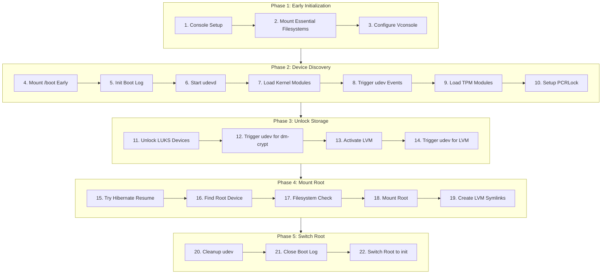

## Phase 1: Early Initialization

### Step 1: Console Setup
- Opens `/dev/console` for read/write
- Falls back to `/dev/tty1` or `/dev/ttyS0` if unavailable
- Redirects stdout/stderr to console
- Suppresses kernel messages (printk level 0)

### Step 2: Mount Essential Filesystems

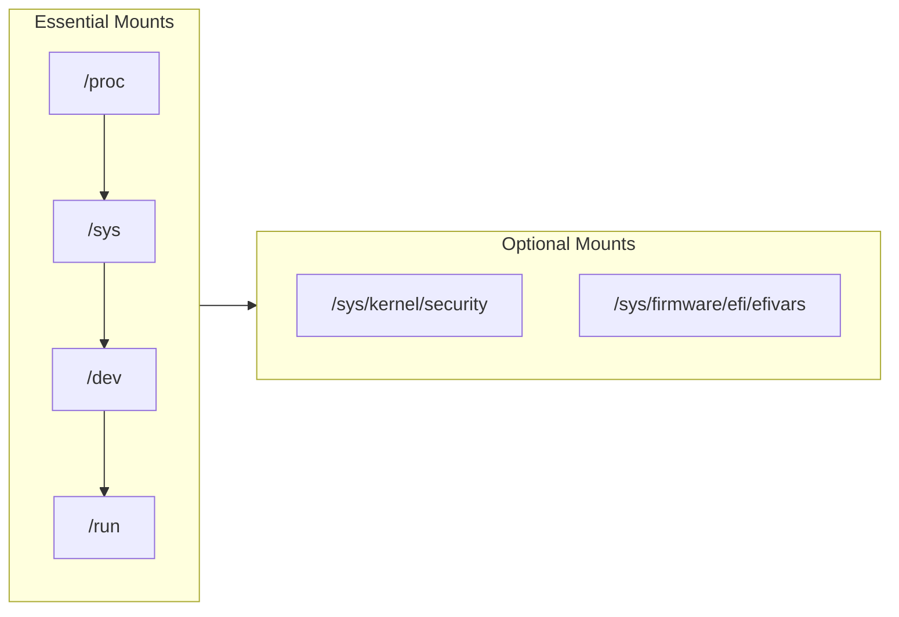

| Mount Point | Type | Purpose |
|-------------|------|---------|
| `/proc` | procfs | Process info, cmdline |
| `/sys` | sysfs | Device tree |
| `/dev` | devtmpfs | Device nodes |
| `/run` | tmpfs | Runtime data |

### Step 3: Vconsole Configuration

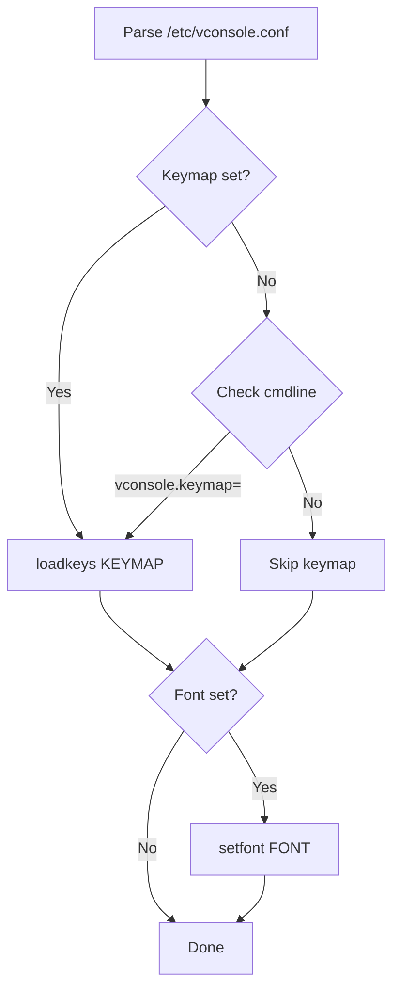

**Critical:** Must happen before any password prompts for non-US keyboard support.

## Phase 2: Device Discovery

### Step 4: Mount /boot Early

The boot partition is mounted early to access `pcrlock.json` (if present) before LUKS unlock.

```mermaid
flowchart TD
    A[Start] --> B{boot= in cmdline?}
    B -->|Yes| C[Use specified device]
    B -->|No| D[Scan partitions]
    D --> E{Find pcrlock.json?}
    E -->|Yes| F[Use that partition]
    E -->|No| G[/boot not found]
    C --> H[Mount as FAT32]
    F --> H
    H --> I[Return success]
    G --> J[Return failure]
```

### Step 5: Init Boot Log

If `/boot` was mounted successfully, the boot log is initialized at `/boot/.vanguard.log`. All subsequent console output is also logged.

### Steps 6-10: Module Loading and TPM Setup

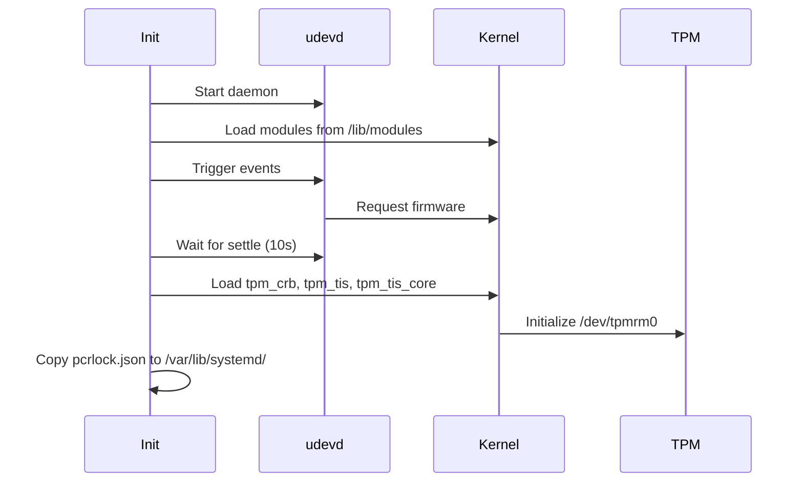

## Phase 3: Unlock Encrypted Storage

### Step 11: LUKS Unlock Strategy

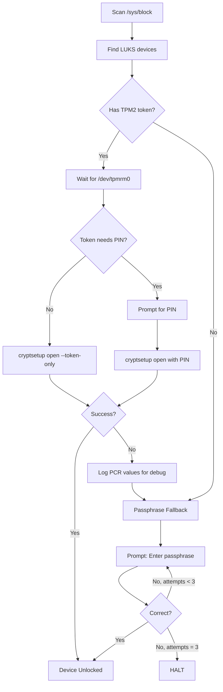

### Step 13: LVM Activation

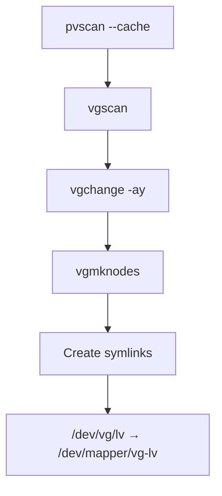

## Phase 4: Mount Root

### Step 15: Hibernate Resume

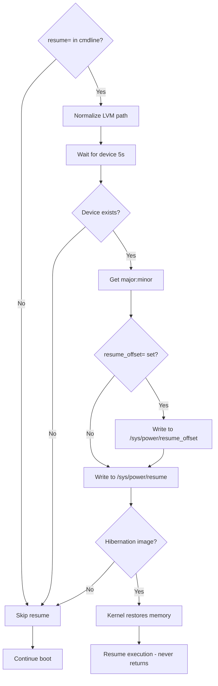

**Note:** Resume happens AFTER LUKS+LVM because swap is typically inside the encrypted volume. The LVM path `/dev/vg0/swap` is automatically normalized to `/dev/mapper/vg0-swap`.

### Step 16: Find Root Device

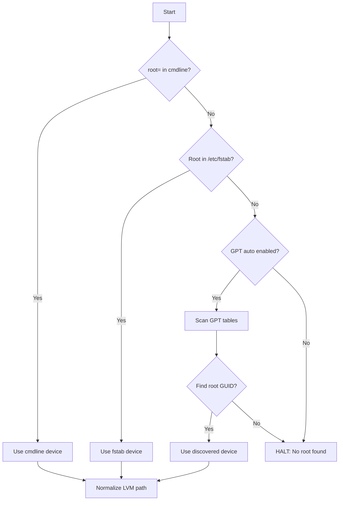

**Root GUID for x86-64:** `4f68bce3-e8cd-4db1-96e7-fbcaf984b709`

### Step 17: Filesystem Check

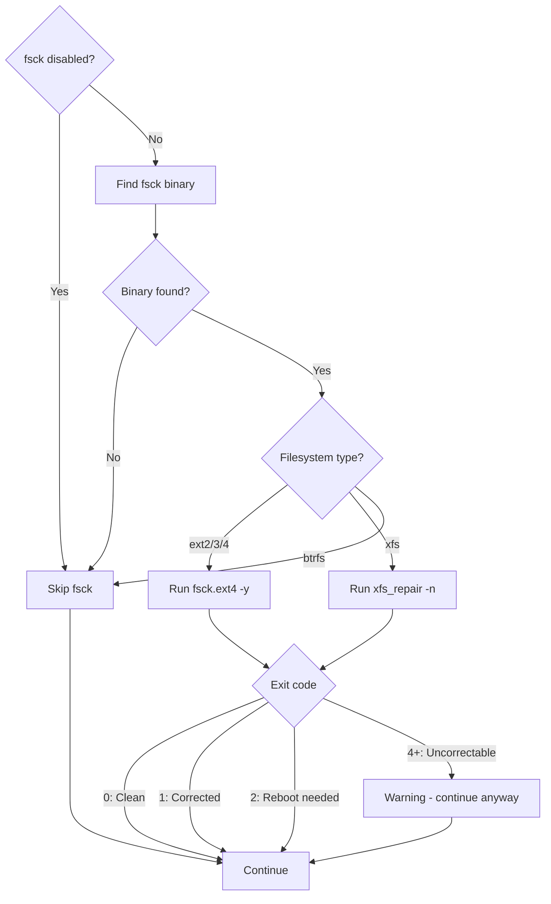

**Note:** btrfs check is skipped at boot time as it's not recommended. Filesystem check can be disabled with `vanguard.fsck=0` or `fsck.mode=skip`.

## Phase 5: Switch Root

### Steps 20-22: Cleanup and Handoff

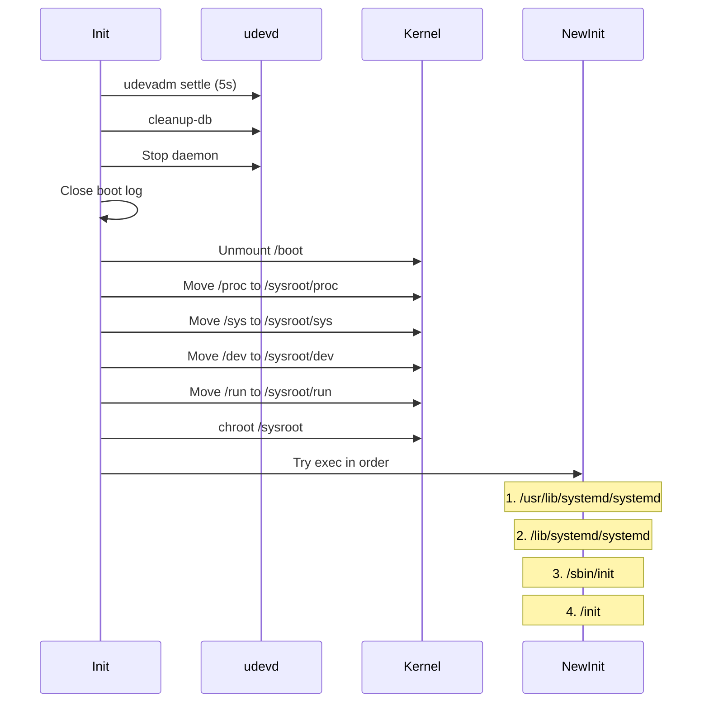

**Note:** Vanguard tries multiple init paths in order. The first one that exists and executes successfully is used.

## Error Handling

```mermaid
flowchart TD
    subgraph fatal["Fatal Errors → HALT"]
        A[No console]
        B[Essential mount fails]
        C[No LUKS devices found]
        D[LUKS unlock fails after 3 attempts]
        E[Root device not found]
        F[Root mount fails]
        G[No init found on root]
    end
    
    subgraph warn["Warnings → Continue"]
        H[/boot mount fails]
        I[LVM activation fails]
        J[fsck fails]
        K[Vconsole config fails]
        L[Resume fails]
        M[PCRLock setup fails]
    end
```

## Boot Logging

When ESP is mounted, events are logged to `/boot/.vanguard.log`:

```
2024-01-15T10:30:00Z BOOT_START
2024-01-15T10:30:00Z ESSENTIAL_MOUNTS status=ok
2024-01-15T10:30:00Z BOOT_MOUNTED status=ok
2024-01-15T10:30:01Z MODULES_LOADED count=15
2024-01-15T10:30:02Z PCRLOCK found=true
2024-01-15T10:30:03Z LUKS_UNLOCK device=/dev/sda2 method=tpm2 status=ok
2024-01-15T10:30:04Z LVM_ACTIVATE status=ok
2024-01-15T10:30:05Z ROOT_MOUNTED target=/sysroot device=/dev/vg0/root status=ok
2024-01-15T10:30:05Z SWITCHROOT target=/sysroot
```

## Debug Mode

Enable verbose output with: `vanguard generate -d -o /boot/initramfs-linux.img`

Debug output shows all boot steps:
```
vanguard: starting init
vanguard: mounting filesystems
vanguard: configuring vconsole
vanguard: loaded keymap us
vanguard: mounting /boot early
vanguard: starting udevd
...
```

## Complete Boot Timeline

```mermaid
gantt
    title Vanguard Boot Sequence
    dateFormat X
    axisFormat %s
    
    section Phase 1
    Console Setup           :a1, 0, 1
    Mount Filesystems       :a2, after a1, 1
    Vconsole Config         :a3, after a2, 1
    
    section Phase 2
    Mount /boot             :b1, after a3, 1
    Init Boot Log           :b2, after b1, 1
    Start udevd             :b3, after b2, 1
    Load Modules            :b4, after b3, 2
    Trigger udev            :b5, after b4, 3
    Load TPM Modules        :b6, after b5, 1
    Setup PCRLock           :b7, after b6, 1
    
    section Phase 3
    Unlock LUKS             :c1, after b7, 3
    udev dm-crypt           :c2, after c1, 2
    Activate LVM            :c3, after c2, 2
    udev LVM                :c4, after c3, 2
    
    section Phase 4
    Try Resume              :d1, after c4, 1
    Find Root               :d2, after d1, 1
    fsck                    :d3, after d2, 2
    Mount Root              :d4, after d3, 1
    Create LVM Symlinks     :d5, after d4, 1
    
    section Phase 5
    Cleanup udev            :e1, after d5, 1
    Close Boot Log          :e2, after e1, 1
    Switch Root             :e3, after e2, 1
```
