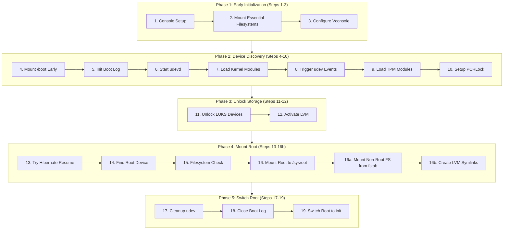
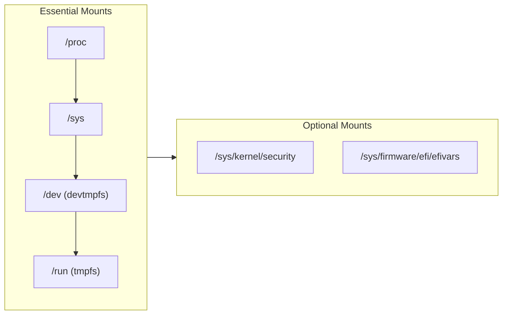
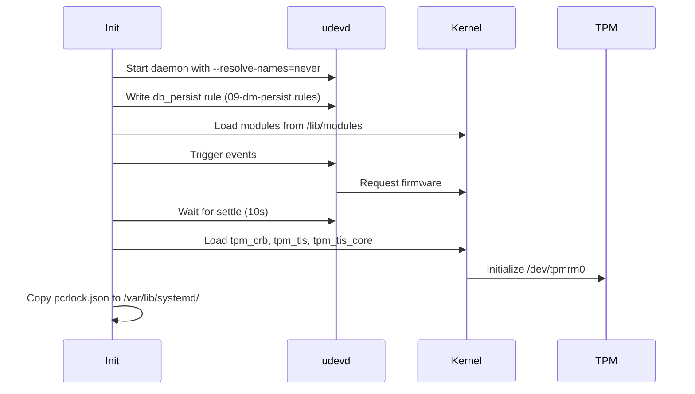
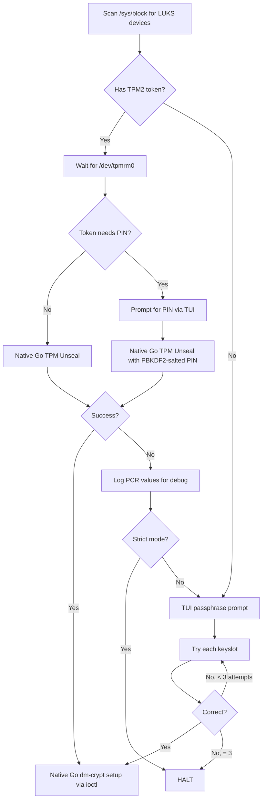
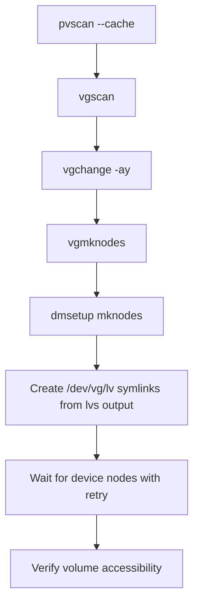
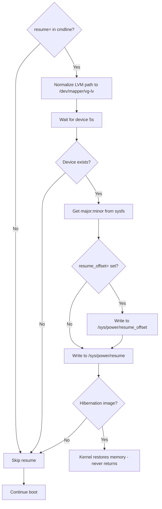
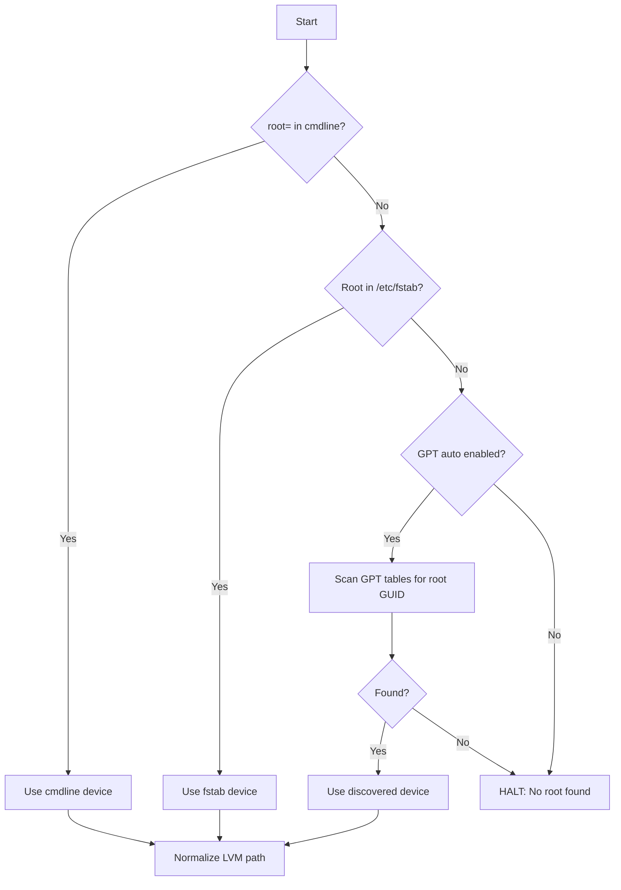
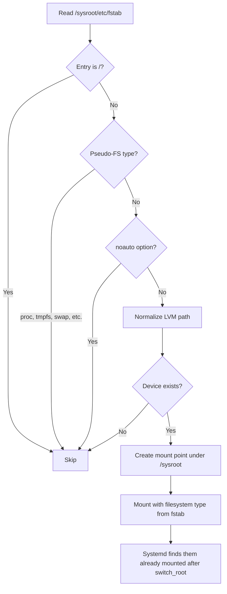

# Vanguard Boot Flow

This document describes the complete boot sequence executed by the Vanguard initramfs.

## Overview

Vanguard's init process is designed for systems with encrypted root filesystems using LUKS + LVM, with TPM2-based automatic unlocking via PCRLock policy. The init binary is a **static Go binary** (`CGO_ENABLED=0`) with native Go LUKS and TPM2 implementations - no external crypto or TPM binaries are needed at runtime.

## Boot Sequence Overview


```mermaid
flowchart TD
    subgraph phase1["Phase 1: Early Initialization (Steps 1-3)"]
        A[1. Console Setup] --> B[2. Mount Essential Filesystems]
        B --> C[3. Configure Vconsole]
    end

    subgraph phase2["Phase 2: Device Discovery (Steps 4-10)"]
        D[4. Mount /boot Early] --> E[5. Init Boot Log]
        E --> F[6. Start udevd]
        F --> G[7. Load Kernel Modules]
        G --> H[8. Trigger udev Events]
        H --> I[9. Load TPM Modules]
        I --> J[10. Setup PCRLock]
    end

    subgraph phase3["Phase 3: Unlock Storage (Steps 11-12)"]
        K[11. Unlock LUKS Devices] --> L[12. Activate LVM]
    end

    subgraph phase4["Phase 4: Mount Root (Steps 13-16b)"]
        M[13. Try Hibernate Resume] --> N[14. Find Root Device]
        N --> O[15. Filesystem Check]
        O --> P[16. Mount Root to /sysroot]
        P --> Q[16a. Mount Non-Root FS from fstab]
        Q --> R[16b. Create LVM Symlinks]
    end

    subgraph phase5["Phase 5: Switch Root (Steps 17-19)"]
        S[17. Cleanup udev] --> T[18. Close Boot Log]
        T --> U[19. Switch Root to init]
    end

    phase1 --> phase2
    phase2 --> phase3
    phase3 --> phase4
    phase4 --> phase5
```

## Phase 1: Early Initialization

### Step 1: Console Setup
- Opens `/dev/console` for read/write
- Falls back to `/dev/tty1` or `/dev/ttyS0` if unavailable
- Redirects stdout/stderr to console
- Suppresses kernel messages (printk level 0)

### Step 2: Mount Essential Filesystems


```mermaid
flowchart LR
    subgraph mounts["Essential Mounts"]
        A["/proc"] --> B["/sys"]
        B --> C["/dev (devtmpfs)"]
        C --> D["/run (tmpfs)"]
    end
    
    subgraph optional["Optional Mounts"]
        E["/sys/kernel/security"]
        F["/sys/firmware/efi/efivars"]
    end
    
    mounts --> optional
```

| Mount Point | Type | Purpose |
|-------------|------|---------|
| `/proc` | procfs | Process info, cmdline parsing |
| `/sys` | sysfs | Device tree |
| `/dev` | devtmpfs | Device nodes |
| `/run` | tmpfs | Runtime data |

### Step 3: Vconsole Configuration

Loads keyboard layout and console font from `/etc/vconsole.conf` or kernel cmdline parameters (`vconsole.keymap=`, `vconsole.font=`). **Must happen before any password prompts** for correct non-US keyboard input.

In non-debug mode, the Bubble Tea **boot TUI** starts after this step, providing visual stage progression with spinner, password prompts, and TPM lockout display.

## Phase 2: Device Discovery

### Step 4: Mount /boot Early

The boot partition is mounted early to access the PCRLock policy file (at the UKI-relative path derived from the `LoaderImageIdentifier` EFI variable) before LUKS unlock.

```mermaid
flowchart TD
    A[Start] --> B{boot= in cmdline?}
    B -->|Yes| C[Use specified device]
    B -->|No| D[Scan partitions for pcrlock.json]
    D --> E{Found?}
    E -->|Yes| F[Use that partition]
    E -->|No| G[/boot not mounted]
    C --> H[Mount as VFAT rw]
    F --> H
```

### Step 5: Init Boot Log

If `/boot` was mounted successfully, boot logging begins at `/boot/.vanguard.log`. All subsequent console output is also captured.

### Steps 6-10: Module Loading and TPM Setup


```mermaid
sequenceDiagram
    participant Init
    participant udevd
    participant Kernel
    participant TPM

    Init->>udevd: Start daemon with --resolve-names=never
    Init->>udevd: Write db_persist rule (09-dm-persist.rules)
    Init->>Kernel: Load modules from /lib/modules
    Init->>udevd: Trigger events
    udevd->>Kernel: Request firmware
    Init->>udevd: Wait for settle (10s)
    Init->>Kernel: Load tpm_crb, tpm_tis, tpm_tis_core
    Kernel->>TPM: Initialize /dev/tpmrm0
    Init->>Init: Copy pcrlock.json to /var/lib/systemd/
```

**db_persist rule:** A custom udev rule (`OPTIONS+="db_persist"` on DM devices) ensures device mapper state survives `switch_root` without needing explicit udev triggers.

## Phase 3: Unlock Encrypted Storage

### Step 11: LUKS Unlock Strategy

Uses **native Go TPM2** (`internal/tpm/`) and **native Go LUKS** (`internal/luks/`) for all operations:


```mermaid
flowchart TD
    A[Scan /sys/block for LUKS devices] --> D{Has TPM2 token?}

    D -->|Yes| E[Wait for /dev/tpmrm0]
    D -->|No| K

    E --> F{Token needs PIN?}
    F -->|No| G[Native Go TPM Unseal]
    F -->|Yes| H[Prompt for PIN via TUI]
    H --> I[Native Go TPM Unseal with PBKDF2-salted PIN]

    G --> J{Success?}
    I --> J

    J -->|Yes| L[Native Go dm-crypt setup via ioctl]
    J -->|No| M[Log PCR values for debug]
    M --> StrictCheck{Strict mode?}
    StrictCheck -->|Yes| P[HALT]
    StrictCheck -->|No| K[TUI passphrase prompt]

    K --> N[Try each keyslot]
    N --> O{Correct?}
    O -->|Yes| L
    O -->|No, < 3 attempts| N
    O -->|No, = 3| P
```

**Token strategy detection** (`init/luks/detect.go`):
- **PIN-only** - no PCRs, no pcrlock → skips policy hash verification
- **PCR policy** - traditional PCR binding → validates against enrolled PCRs
- **PCRLock** - pcrlock.json found → builds super-PCR policy with PolicyAuthorizeNV

### Step 12: LVM Activation


```mermaid
flowchart TD
    A[pvscan --cache] --> B[vgscan]
    B --> C[vgchange -ay]
    C --> D[vgmknodes]
    D --> E[dmsetup mknodes]
    E --> F[Create /dev/vg/lv symlinks from lvs output]
    F --> G[Wait for device nodes with retry]
    G --> H[Verify volume accessibility]
```

**No `DM_DISABLE_UDEV=1` is set** - udev handles device node creation through `10-dm.rules` and `11-dm-lvm.rules`. The db_persist rule ensures state survives switch_root.

## Phase 4: Mount Root

### Step 13: Hibernate Resume

Attempts resume **after** LUKS unlock and LVM activation since swap is typically inside the encrypted volume.


```mermaid
flowchart TD
    A{resume= in cmdline?} -->|No| B[Skip resume]
    A -->|Yes| C[Normalize LVM path to /dev/mapper/vg-lv]
    C --> D[Wait for device 5s]
    D --> E{Device exists?}
    E -->|No| B
    E -->|Yes| F[Get major:minor from sysfs]
    F --> G{resume_offset= set?}
    G -->|Yes| H[Write to /sys/power/resume_offset]
    G -->|No| I[Write to /sys/power/resume]
    H --> I
    I --> J{Hibernation image?}
    J -->|Yes| K[Kernel restores memory - never returns]
    J -->|No| B
    B --> M[Continue boot]
```

### Step 14: Find Root Device


```mermaid
flowchart TD
    A[Start] --> B{root= in cmdline?}
    B -->|Yes| C[Use cmdline device]
    B -->|No| D{Root in /etc/fstab?}
    D -->|Yes| E[Use fstab device]
    D -->|No| F{GPT auto enabled?}
    F -->|Yes| G[Scan GPT tables for root GUID]
    G --> H{Found?}
    H -->|Yes| I[Use discovered device]
    H -->|No| J[HALT: No root found]
    F -->|No| J
    
    C --> K[Normalize LVM path]
    E --> K
    I --> K
```

**LVM path normalization** (`/dev/vg0/root` → `/dev/mapper/vg0-root`) is applied to all discovered devices.

### Step 15: fsck

Runs filesystem check before mounting root. Can be disabled with `vanguard.fsck=0` or `fsck.mode=skip` on the kernel cmdline.

### Step 16: Mount Root

Mounts the root filesystem to `/sysroot` using the detected filesystem type (from fstab, magic bytes, or blkid-style fallback).

### Step 16a: Mount Non-Root Filesystems


```mermaid
flowchart TD
    A[Read /sysroot/etc/fstab] --> B{Entry is /?}
    B -->|Yes| C[Skip]
    B -->|No| D{Pseudo-FS type?}
    D -->|proc, tmpfs, swap, etc.| C
    D -->|No| E{noauto option?}
    E -->|Yes| C
    E -->|No| F[Normalize LVM path]
    F --> G{Device exists?}
    G -->|No| C
    G -->|Yes| H[Create mount point under /sysroot]
    H --> I[Mount with filesystem type from fstab]
    I --> J[Systemd finds them already mounted after switch_root]
```

**Why:** After switch_root, the udev database may have `SYSTEMD_READY=0` on DM devices from coldplug non-primary events. By mounting `/home` and other non-root filesystems in the initramfs, systemd inherits pre-mounted filesystems and doesn't wait for device nodes that may never become "ready."

### Step 16b: Create LVM Symlinks

Creates `/dev/<vg>/<lv>` → `/dev/mapper/<vg>-<lv>` symlinks in the initramfs devtmpfs. Since switch_root uses `MS_MOVE` to transfer `/dev` to `/sysroot/dev`, these symlinks survive unscathed into the real root.

## Phase 5: Switch Root

### Steps 17-19: Cleanup and Handoff

```mermaid
sequenceDiagram
    participant Init
    participant udevd
    participant Kernel
    participant NewInit

    Init->>udevd: udevadm settle (5s)
    Init->>udevd: Trigger graphics (DRM subsystem)
    Init->>udevd: Settle (2s)
    Init->>udevd: Stop daemon gracefully (SIGTERM)
    
    Init->>Init: Ensure LVM symlinks in /dev
    Init->>Init: Close boot log
    Init->>Kernel: Unmount /boot
    
    Init->>Init: Stop TUI, reset terminal
    
    Init->>Kernel: MS_MOVE /proc to /sysroot/proc
    Init->>Kernel: MS_MOVE /sys to /sysroot/sys
    Init->>Kernel: MS_MOVE /dev to /sysroot/dev
    Init->>Kernel: MS_MOVE /run to /sysroot/run
    
    Init->>Kernel: chdir /sysroot
    Init->>Kernel: MS_MOVE /sysroot to /
    Init->>Kernel: chroot . ; chdir /
    Init->>NewInit: exec init
    
    Note over NewInit: 1. /usr/lib/systemd/systemd
    Note over NewInit: 2. /lib/systemd/systemd
    Note over NewInit: 3. /sbin/init
    Note over NewInit: 4. /init
```

**Critical:** The TUI is stopped and terminal reset **before** switch_root to release the DRM master lock and restore normal terminal state for systemd.

## Error Handling

```mermaid
flowchart TD
    subgraph fatal["Fatal Errors → HALT"]
        A[No console]
        B[Essential mount fails]
        C[No LUKS devices found]
        D[LUKS unlock fails after 3 passphrase attempts]
        E[Root device not found]
        F[Root mount fails]
        G[No init found on root]
    end
    
    subgraph warn["Warnings → Continue"]
        H[/boot mount fails]
        I[LVM activation fails]
        J[fsck fails]
        K[Vconsole config fails]
        L[Resume fails]
        M[PCRLock setup fails]
        N[Non-root FS mount fails]
        O[LVM symlink creation fails]
    end
```

## Boot Logging

When ESP is mounted, events are logged to `/boot/.vanguard.log`:

```
2024-01-15T10:30:00Z BOOT_START
2024-01-15T10:30:00Z ESSENTIAL_MOUNTS status=ok
2024-01-15T10:30:00Z BOOT_MOUNTED status=ok
2024-01-15T10:30:01Z MODULES_LOADED count=15
2024-01-15T10:30:02Z PCRLOCK found=true
2024-01-15T10:30:03Z LUKS_UNLOCK device=/dev/nvme0n1p2 method=token status=ok
2024-01-15T10:30:04Z LVM_ACTIVATE status=ok
2024-01-15T10:30:05Z ROOT_MOUNTED target=/sysroot device=/dev/gentoo/root status=ok
2024-01-15T10:30:05Z DEBUG msg=/home mounted on /sysroot/home
2024-01-15T10:30:05Z SWITCHROOT target=/sysroot
```

## Debug Mode

Enable verbose output with: `vanguard generate -d -o /boot/initramfs-linux.img`

Debug output shows all boot steps with detailed TPM2, LUKS, and LVM status messages. In debug mode, the boot TUI is disabled so all output goes directly to the console.

## Build Variants

Vanguard produces 2 init binaries via Go build tags from the same source:

| Build Tags | Binary | Output | Passphrase Fallback |
|------------|--------|--------|:---:|
| (none) | `init` | Minimal | TOTP only |
| `debug` | `init-debug` | Verbose | TOTP only |

Strict mode is always-on. Passphrase fallback requires TOTP recovery (no `-s` flag needed).
