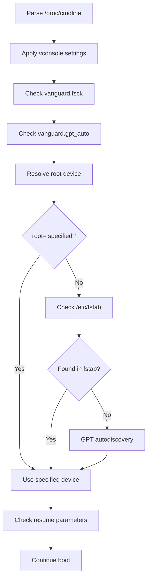

# Kernel Command Line Parameters

This document describes the kernel command line parameters recognized by Vanguard initramfs.

## Root Device Parameters

### root=

Specifies the root filesystem device.

```
root=/dev/mapper/vg0-root
root=UUID=12345678-1234-1234-1234-123456789abc
root=PARTUUID=12345678-1234-1234-1234-123456789abc
root=/dev/sda2
```

**Formats supported:**
- Device path: `/dev/sda2`, `/dev/nvme0n1p2`
- Device mapper path: `/dev/mapper/vg0-root`
- LVM path: `/dev/vg0/root`
- UUID: `UUID=<uuid>`
- Partition UUID: `PARTUUID=<partuuid>`

**Priority:** If not specified, Vanguard falls back to `/etc/fstab`, then GPT autodiscovery.

### boot=

Specifies the boot partition containing TPM2 pcrlock.json policy file.

```
boot=/dev/sda1
boot=/dev/nvme0n1p1
```

**Formats supported:**
- Device path only: `/dev/sda1`, `/dev/nvme0n1p1`

**Note:** UUID and PARTUUID formats are not currently supported for the `boot=` parameter. If not specified, Vanguard scans partitions to find one containing `pcrlock.json` by trying to mount each partition as FAT32.

---

## Resume (Hibernation) Parameters

### resume=

Specifies the swap device for resume from hibernation.

```
resume=/dev/vg0/swap
resume=/dev/mapper/vg0-swap
resume=UUID=87654321-4321-4321-4321-cba987654321
```

**Important:** When swap is inside an encrypted LUKS volume (common with LVM), Vanguard handles this correctly by attempting resume AFTER LUKS unlock and LVM activation.

**Formats supported:**
- Device path: `/dev/sda3`
- LVM path: `/dev/vg0/swap` (automatically normalized to `/dev/mapper/vg0-swap`)
- Device mapper path: `/dev/mapper/vg0-swap`
- UUID: `UUID=<uuid>`
- Partition UUID: `PARTUUID=<partuuid>`

### resume_offset=

Specifies the offset for swap file resume (when using a swap file instead of a swap partition).

```
resume=/dev/mapper/vg0-root resume_offset=12345678
```

**Note:** The offset can be obtained using `filefrag -v /swapfile` and looking at the first physical offset.

---

## Vanguard-Specific Parameters

### vanguard.fsck=

Controls filesystem check before mounting root.

```
vanguard.fsck=0     # Disable fsck
vanguard.fsck=no    # Disable fsck
```

**Default:** Enabled. Vanguard runs fsck on the root device before mounting.

**Alternative:** `fsck.mode=skip` is also recognized for compatibility.

### vanguard.gpt_auto=

Controls GPT partition autodiscovery.

```
vanguard.gpt_auto=0     # Disable GPT autodiscovery
vanguard.gpt_auto=no    # Disable GPT autodiscovery
```

**Default:** Enabled. Vanguard uses GPT partition type GUIDs to discover root and ESP partitions when not explicitly specified.

**GPT Type GUIDs used:**
| Partition | GUID |
|-----------|------|
| Root (x86-64) | `4f68bce3-e8cd-4db1-96e7-fbcaf984b709` |
| ESP | `c12a7328-f81f-11d2-ba4b-00a0c93ec93b` |

---

## Vconsole Parameters

These parameters configure the virtual console (keyboard layout and font) early in boot, ensuring correct input for LUKS password prompts.

### vconsole.keymap=

Sets the keyboard layout.

```
vconsole.keymap=de-latin1
vconsole.keymap=us
vconsole.keymap=fr
```

**Note:** Overrides the `KEYMAP` setting in `/etc/vconsole.conf`.

### vconsole.keymap_toggle=

Sets the toggle keymap (alternative layout).

```
vconsole.keymap_toggle=us
```

### vconsole.font=

Sets the console font.

```
vconsole.font=eurlatgr
vconsole.font=lat9w-16
vconsole.font=ter-v16n
```

**Note:** Overrides the `FONT` setting in `/etc/vconsole.conf`.

### vconsole.font_map=

Sets the console font map.

```
vconsole.font_map=8859-1
```

### vconsole.font_unimap=

Sets the console font unicode map.

```
vconsole.font_unimap=lat1u.uni
```

---

## Standard Linux Parameters

Vanguard passes through standard Linux kernel parameters but does not specifically parse all of them. The following are notable:

### quiet / debug

These affect kernel message verbosity but Vanguard's own debug output is controlled by the `-d` flag at initramfs generation time.

### init=

**Note:** Vanguard does NOT parse the `init=` parameter. Instead, it tries a fixed list of init paths in order:

1. `/usr/lib/systemd/systemd`
2. `/lib/systemd/systemd`
3. `/sbin/init`
4. `/init`

The first one that exists and executes successfully is used.

---

## Example Boot Configurations

### Basic LUKS + LVM Setup

```
root=/dev/mapper/vg0-root resume=/dev/vg0/swap
```

### German Keyboard with Custom Font

```
root=/dev/mapper/vg0-root vconsole.keymap=de-latin1 vconsole.font=eurlatgr
```

### GPT Autodiscovery (No Explicit Root)

```
# Vanguard discovers root from GPT partition type GUID
resume=/dev/vg0/swap
```

### Disable fsck for Fast Boot

```
root=/dev/mapper/vg0-root vanguard.fsck=0
```

### Full Example

```
root=/dev/mapper/vg0-root resume=/dev/vg0/swap vconsole.keymap=us quiet
```

---

## Parameter Processing Order

Vanguard processes parameters in this order:



---

## See Also

- [Boot Flow](boot-flow.md) - Detailed boot sequence documentation
- [Configuration](configuration.md) - CLI and configuration file options
- [TPM2 Setup](tpm2-setup.md) - TPM2 enrollment and policy setup
