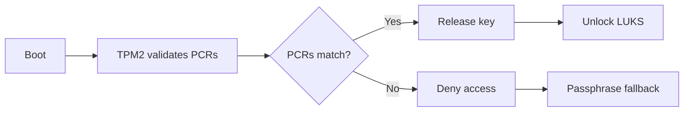
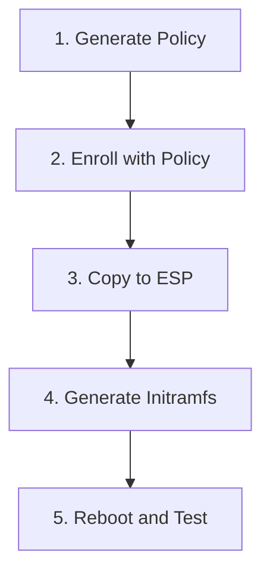
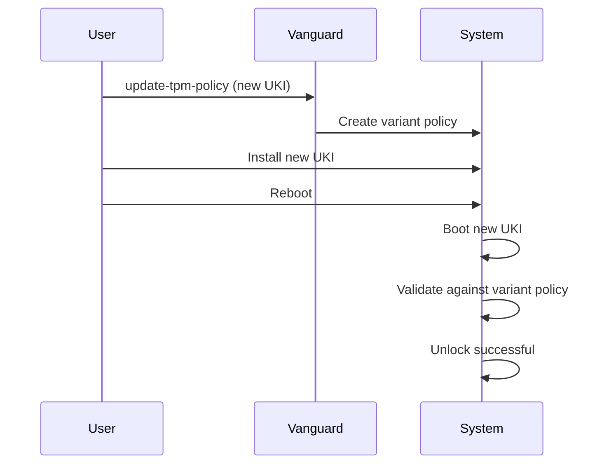

# TPM2 Setup Guide

This guide covers setting up TPM2-based automatic disk encryption unlocking with Vanguard.

## Overview

Vanguard supports automatic LUKS unlocking using TPM2 tokens enrolled via `systemd-cryptenroll`. The TPM2 chip stores the encryption key sealed to specific Platform Configuration Register (PCR) values, ensuring the disk can only be unlocked when the system is in a known-good state.



## Prerequisites

### Required Packages
- `systemd` (version 251+)
- `tpm2-tss`
- `tpm2-tools`
- `cryptsetup` (version 2.4+)

### System Requirements
- TPM 2.0 chip (hardware or firmware-based)
- UEFI Secure Boot (recommended)
- LUKS2 encrypted partition

### Verify TPM is Available

```bash
# Check for TPM device
ls -la /dev/tpm*

# Expected output:
# crw-rw---- 1 tss root 10, 224 Jan 15 10:00 /dev/tpm0
# crw-rw---- 1 tss root 253, 65536 Jan 15 10:00 /dev/tpmrm0

# Check TPM capabilities
tpm2_getcap properties-fixed
```

## Basic TPM2 Enrollment

### Step 1: Enroll TPM2 Token

```bash
# Basic enrollment (binds to PCR 7 - Secure Boot state)
sudo systemd-cryptenroll --tpm2-device=auto /dev/sdX
```

This creates a LUKS token that allows automatic unlocking when:
- The same TPM chip is present
- Secure Boot state (PCR 7) matches

### Step 2: Verify Enrollment

```bash
# List LUKS tokens
sudo cryptsetup luksDump /dev/sdX | grep -A5 "Tokens:"

# Expected output shows systemd-tpm2 token:
# Tokens:
#   0: systemd-tpm2
#         tpm2-pcrs: 7
#         tpm2-pcr-bank: sha256
```

### Step 3: Test Unlock

```bash
# Test token-based unlock
sudo cryptsetup open --token-only /dev/sdX test_unlock
sudo cryptsetup close test_unlock
```

## TPM2 with PIN

For additional security, require a PIN in addition to TPM2 validation.

```bash
# Enroll with PIN requirement
sudo systemd-cryptenroll --tpm2-device=auto --tpm2-with-pin=yes /dev/sdX

# You'll be prompted to set a PIN
```

During boot, Vanguard will:
1. Detect that the TPM2 token requires a PIN
2. Prompt: `Enter TPM2 PIN for /dev/sdX:`
3. Use the PIN to unseal the key from TPM2

## PCRLock Policy

PCRLock provides fine-grained control over which boot measurements are validated. This is more robust than simple PCR binding because it uses predicted values rather than current values.

### Understanding PCRs

| PCR | Contents | Stability | Used by Vanguard |
|-----|----------|-----------|------------------|
| 0 | BIOS/UEFI firmware | Changes on firmware update | No |
| 1 | BIOS configuration | Changes on BIOS settings change | No |
| 2 | External code (Option ROMs) | Varies | Optional |
| 3 | External configuration | Varies | Optional |
| 4 | Boot loader code (EFI binaries) | Changes on bootloader/UKI update | Yes |
| 7 | Secure Boot state | Stable if SB enabled | **Yes (required)** |
| 8 | LUKS header (custom extension) | Changes if LUKS modified | Yes (if enabled) |
| 9 | Kernel command line | Changes on cmdline change | No |
| 11 | Unified kernel measurements | Changes on UKI update | No |
| 15 | systemd machine-id, root-fs | Extended during boot | **No (masked)** |

**Important:** PCR 15 is explicitly masked/disabled in Vanguard's policy because Vanguard unlocks LUKS **before** systemd extends PCR 15, causing a timing mismatch that would always fail.

### Setup PCRLock Policy



#### Step 1: Generate Policy

```bash
# Generate PCRLock policy for your UKI
sudo vanguard update-tpm-policy --uki-path /boot/EFI/Linux/kernel.efi

# With LUKS header measurement (PCR 8)
sudo vanguard update-tpm-policy \
  --uki-path /boot/EFI/Linux/kernel.efi \
  --luks-device /dev/sda2
```

This creates `/etc/boot-bundle/pcrlock.json` with predicted PCR values.

#### Step 2: Enroll with PCRLock

```bash
# Remove old TPM2 token (if any)
sudo systemd-cryptenroll --wipe-slot=tpm2 /dev/sdX

# Enroll with PCRLock policy
sudo systemd-cryptenroll --tpm2-device=auto \
  --tpm2-pcrlock=/etc/boot-bundle/pcrlock.json \
  /dev/sdX
```

#### Step 3: Copy Policy to ESP

```bash
# Copy policy where initramfs can find it
sudo cp /etc/boot-bundle/pcrlock.json /boot/pcrlock.json
```

#### Step 4: Generate Initramfs

```bash
sudo vanguard generate -o /boot/initramfs-linux.img
```

#### Step 5: Reboot and Test

```bash
sudo reboot
```

The system should:
1. Boot and mount ESP
2. Copy pcrlock.json to initramfs
3. Validate PCRs against policy
4. Unlock LUKS automatically

## Updating Kernel/UKI

When updating the kernel, the PCRLock policy must be updated BEFORE the new kernel is booted.



### Update Workflow

```bash
# 1. Update policy BEFORE installing new kernel
sudo vanguard update-tpm-policy --uki-path /path/to/new/kernel.efi

# 2. Copy updated policy to ESP
sudo cp /etc/boot-bundle/pcrlock.json /boot/pcrlock.json

# 3. Install the new kernel/UKI
# (distribution-specific commands)

# 4. Reboot
sudo reboot
```

### Variant Directories

Vanguard uses systemd-pcrlock's variant directory feature to allow both the old and new kernel to unlock:

- Creates `/etc/pcrlock.d/510-uki.pcrlock.d/new.pcrlock`
- Contains measurements for the new UKI
- Policy accepts either old or new measurements
- After reboot, old variant can be removed

## Troubleshooting

### TPM Unlock Fails - PCR Mismatch

**Symptom:** Boot falls back to passphrase prompt with message `cryptsetup: falling back to passphrase`

**Debug:** When built with debug mode (`-d`), Vanguard logs the enrolled PCRs and their current values:
```
cryptsetup: TPM2 unlock failed - enrolled PCRs: 7 (bank: sha256)
cryptsetup: current PCR values:
  PCR 7: 0xABC123...
```

This information is also written to the boot log at `/boot/.vanguard.log` with events:
- `TPM_PCR_MISMATCH` - Shows which PCRs were enrolled
- `TPM_PCR_VALUE` - Shows current value of each enrolled PCR

**Common Causes:**
1. Secure Boot state changed (PCR 7)
2. Firmware updated (PCR 0, 2)
3. Boot loader/UKI updated (PCR 4)
4. LUKS header modified (PCR 8, if enrolled)

**Solution:**
1. Boot with passphrase
2. Re-enroll TPM2 token with current state:
   ```bash
   sudo systemd-cryptenroll --wipe-slot=tpm2 /dev/sdX
   sudo systemd-cryptenroll --tpm2-device=auto /dev/sdX
   ```
3. Or regenerate PCRLock policy if using that:
   ```bash
   sudo vanguard update-tpm-policy -u /boot/EFI/Linux/kernel.efi
   sudo cp /etc/boot-bundle/pcrlock.json /boot/pcrlock.json
   ```

### TPM Device Not Found

**Symptom:** `TPM device not available` in boot log, or `TPM_UNAVAILABLE` event logged

**Check:**
```bash
# Verify TPM is enabled in BIOS/UEFI
# Check kernel modules
lsmod | grep tpm
# Should show: tpm_crb, tpm_tis, tpm_tis_core

# Check device exists
ls -la /dev/tpm*
# Should show /dev/tpm0 and /dev/tpmrm0
```

Vanguard looks for `/dev/tpmrm0` (resource manager) or `/dev/tpm0` and waits up to 3 seconds for them to appear.

**Solution:**
1. Enable TPM in BIOS/UEFI settings
2. Ensure kernel has TPM support:
   ```bash
   zcat /proc/config.gz | grep CONFIG_TCG_TPM
   # Should show CONFIG_TCG_TPM=y or CONFIG_TCG_TPM=m
   ```
3. Vanguard automatically loads `tpm_crb`, `tpm_tis`, and `tpm_tis_core` modules during boot

### PIN Prompt Not Appearing

**Symptom:** TPM unlock fails without PIN prompt

**Check:**
```bash
# Verify token has PIN requirement
sudo cryptsetup luksDump /dev/sdX | grep tpm2-pin
# Should show: tpm2-pin: true
```

**Solution:** Re-enroll with PIN:
```bash
sudo systemd-cryptenroll --wipe-slot=tpm2 /dev/sdX
sudo systemd-cryptenroll --tpm2-device=auto --tpm2-with-pin=yes /dev/sdX
```

### PCRLock Policy Invalid

**Symptom:** `pcrlock.json validation failed`

**Common Causes:**
1. Policy generated on different system
2. UKI path incorrect
3. systemd-pcrlock not available

**Debug:**
```bash
# Verify policy
sudo systemd-pcrlock predict
```

**Solution:** Regenerate policy:
```bash
sudo vanguard update-tpm-policy --uki-path /boot/EFI/Linux/kernel.efi
```

## Security Considerations

### PCR Selection

| Approach | Security | Usability |
|----------|----------|-----------|
| PCR 7 only | Low | High - survives most updates |
| PCR 7 + 4 | Medium | Medium - breaks on bootloader update |
| PCRLock | High | Medium - requires policy updates |
| PCRLock + PIN | Highest | Low - requires PIN every boot |

### Recommendations

1. **Always use Secure Boot** - PCR 7 is only meaningful with Secure Boot enabled
2. **Use PCRLock for production** - More robust than simple PCR binding
3. **Consider PIN for high-security** - Prevents attacks if device is stolen while suspended
4. **Keep passphrase backup** - Always maintain a recovery passphrase slot
5. **Test updates in VM first** - Verify policy updates work before production

## Recovery

### Emergency Recovery

If TPM unlock fails and you don't have the passphrase:

1. Boot from live USB
2. Unlock with recovery key (if enrolled)
3. Re-enroll TPM2 token

### Backup Passphrase Slot

Always keep a passphrase slot for recovery:

```bash
# Add passphrase slot (if not present)
sudo cryptsetup luksAddKey /dev/sdX

# Verify slots
sudo cryptsetup luksDump /dev/sdX | grep "Key Slot"
```
