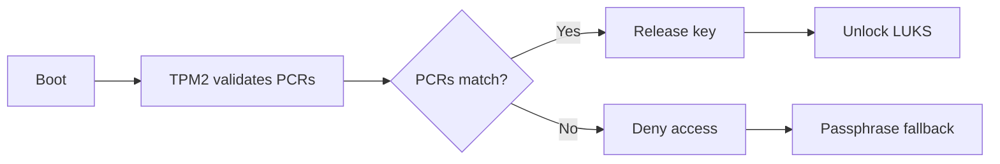
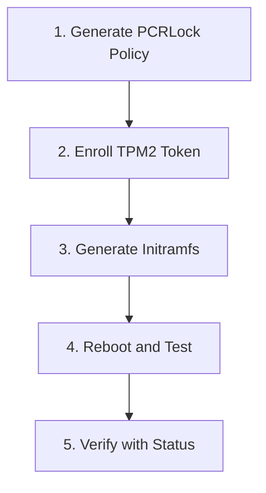
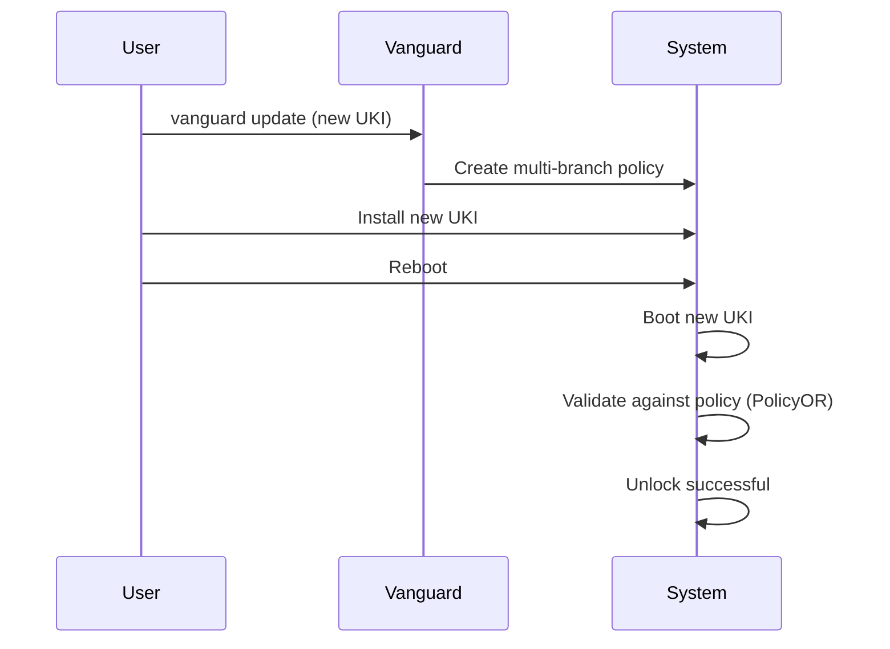

# TPM2 Setup Guide

This guide covers setting up TPM2-based automatic disk encryption unlocking with Vanguard.

## Overview

Vanguard uses a **native Go TPM2 stack** (`internal/tpm/`) for LUKS token unsealing. No external TPM tools are needed at runtime. The TPM chip stores the LUKS key sealed to Platform Configuration Register (PCR) values via PCRLock policy, ensuring the disk can only be unlocked when the system is in a known-good state.


```mermaid
flowchart LR
    A[Boot] --> B[TPM2 validates PCRs]
    B --> C{PCRs match?}
    C -->|Yes| D[Release key]
    C -->|No| E[Deny access]
    D --> F[Unlock LUKS]
    E --> G[Passphrase fallback]
```

## Prerequisites

### Required Packages
- `systemd` (version 251+)
- `tpm2-tss`
- `systemd-pcrlock` (at `/lib/systemd/systemd-pcrlock` or `/usr/lib/systemd/systemd-pcrlock`)

### System Requirements
- TPM 2.0 chip (hardware or firmware-based)
- UEFI Secure Boot (recommended)
- LUKS2 encrypted partition

### Verify TPM is Available

```bash
# Check for TPM device
ls -la /dev/tpm*

# Expected output:
# crw-rw---- 1 root root 10, 224 /dev/tpm0
# crw-rw---- 1 root root 253, 65536 /dev/tpmrm0

# Check TPM capabilities
tpm2_getcap properties-fixed
```

## PCRLock Policy

PCRLock provides fine-grained control over which boot measurements are validated using **predicted values** rather than current values. Vanguard's policy creates **multi-branch PCR predictions** (PolicyOR) where multiple PCR values are accepted, enabling firmware variation handling.

### Understanding PCRs

| PCR | Contents | Enforced | Notes |
|-----|----------|:--------:|-------|
| 2 | External code | ✓ Enforced (2 branches) | Option ROMs |
| 3 | External config | ✓ Enforced (2 branches) | |
| 4 | Boot loader code (UKI) | ✓ Enforced (up to 3 branches) | Multi-branch handles firmware variance |
| 5 | GPT partition table | Optional (`-l` flag) | Auto-enabled with `--luks-device` |
| 7 | Secure Boot state | ✓ Enforced (up to 2 branches) | Primary security PCR |
| 13 | sysexts | — Unbound (all-zeros) | |
| 14 | shim-policy | — Unbound (all-zeros) | |

**Unbound PCRs** (13, 14) appear in the policy as all-zeros because no measurements are made. They don't affect unlock — they're placeholders.

### PCR 4 Multi-Branch Prediction

PCR 4 (boot-loader-code) uses **PolicyOR** with up to 3 predicted values covering firmware event variations:

1. **`pe.pcrlock`** — `lock-pe` measurement of the UKI file (most reliable for PCR 4 when sd-stub uses LoadImage)
2. **`uki.pcrlock`** — `lock-uki` measurement (includes PCR 11 measurements; may fail on some systems, treated as fallback)
3. **`eventlog.pcrlock`** — Last `EV_EFI_BOOT_SERVICES_APPLICATION` event extracted from the current boot's CEL event log. This ensures the currently-booted kernel is recognized even if the file on disk has been replaced.

This means PCR 4 won't prevent unlock unless the UKI itself has been tampered with — legitimate firmware variations are handled by the multi-branch policy.

### Secure Boot (PCR 7)

PCR 7 is the most security-critical PCR. It measures the Secure Boot state:

- `0x8E09...` = Secure Boot enabled with valid signed boot chain
- `0x940A...` = Alternative valid state (varies by firmware)

**Without PCR 7 in the policy, a compromised Secure Boot state would still allow disk unlock.** Run `vanguard status` to verify PCR 7 is present and matching.

### GPT Partition Table Binding (PCR 5)

When `--luks-device` (`-l`) is specified, Vanguard automatically enables GPT partition table binding:

**Benefits:**
- Validates correct disk identity (partition layout + GUIDs)
- Prevents attacks using a different disk with same UKI

**Caveats:** Partition changes break unlock — re-run `vanguard update -l <device>` after.

## Setup Workflow


```mermaid
flowchart TD
    A[1. Generate PCRLock Policy] --> B[2. Enroll TPM2 Token]
    B --> C[3. Generate Initramfs]
    C --> D[4. Reboot and Test]
    D --> E[5. Verify with Status]
```

### Step 1: Generate PCRLock Policy

```bash
# Basic policy (PCRs 2, 3, 4, 7)
sudo vanguard update -u /boot/EFI/Gentoo/kernel.efi

# With GPT binding (adds PCR 5)
sudo vanguard update -u /boot/EFI/Gentoo/kernel.efi -l /dev/nvme0n1p2

# With old NV index cleanup
sudo vanguard update -u /boot/EFI/Gentoo/kernel.efi -l /dev/nvme0n1p2 -c
```

This creates `<uki-path>.pcrlock.json` (e.g., `/boot/EFI/Gentoo/kernel.pcrlock.json`).

### Step 2: Enroll TPM2 Token

```bash
sudo systemd-cryptenroll --wipe-slot=tpm2 --tpm2-device=auto \
  --tpm2-with-pin=yes \
  --tpm2-pcrlock=/boot/EFI/Gentoo/kernel.pcrlock.json \
  /dev/nvme0n1p2
```

### Step 3: Generate Initramfs

```bash
sudo vanguard generate -o /boot/initramfs-linux.img
```

### Step 4: Reboot and Test

```bash
sudo reboot
```

### Step 5: Verify Status

```bash
sudo vanguard status
```

Expected output:
```
  PROTECTION TIER: █████████████  HIGH
╭─ LUKS2  /dev/nvme0n1p2 ────────╮
│  Token: systemd-tpm2 PIN pcrlock│
│  NV:    0x1b8225b               │
╰─────────────────────────────────╯
╭─ TPM 2.0 ───────────────────────╮
│  Device: /dev/tpmrm0 available  │
╰─────────────────────────────────╯
╭─ BOOT INTEGRITY ────────────────╮
│  NV: 0x1b8225b present on TPM   │
│  ✓ PCR 2  external-code         │
│  ✓ PCR 3  external-config       │
│  ✓ PCR 4  boot-loader-code      │
│  ✓ PCR 7  secure-boot-policy    │
╰─────────────────────────────────╯
```

## Native Go TPM Stack

Vanguard's init binary uses **zero external TPM dependencies** at runtime:

| Component | Implementation |
|-----------|---------------|
| TPM communication | `google/go-tpm` via `tpmdirect` API |
| Sealed key unseal | Native PolicyPCR + PolicyAuthorizeNV (pcrlock) |
| PIN derivation | PBKDF2-HMAC-SHA256 with salt from LUKS token |
| SRK management | Transient creation, persistent handle, or tpm2_srk data |
| LUKS unlock | Native Go LUKS v1/v2 (`internal/luks/`) — no libcryptsetup |

All crypto is handled in-process. The only binaries included in the initramfs are `lvm`, `systemd-udevd`/`udevadm`, and `dmsetup`.

## Verify Policy

Verify the TPM, NV index, and LUKS token are synchronized:

```bash
# Basic verification (NV Index + PCR values)
sudo vanguard verify -p /boot/EFI/Gentoo/kernel.pcrlock.json

# With LUKS token validation
sudo vanguard verify -p /boot/EFI/Gentoo/kernel.pcrlock.json -l /dev/nvme0n1p2
```

Three checks run:
1. **NV Index sync** — TPM NV index auth policy + size match policy file
2. **PCR validation** — Current PCR values against policy expectations
3. **LUKS token** (with `-l`) — Token references correct NV index + enforces pcrlock

## Updating Kernel/UKI

When updating the kernel, update the PCRLock policy **before** booting the new kernel:


```mermaid
sequenceDiagram
    participant User
    participant Vanguard
    participant System
    
    User->>Vanguard: vanguard update (new UKI)
    Vanguard->>System: Create multi-branch policy
    User->>System: Install new UKI
    User->>System: Reboot
    System->>System: Boot new UKI
    System->>System: Validate against policy (PolicyOR)
    System->>System: Unlock successful
```

### Update Workflow

```bash
# 1. Update policy BEFORE installing new kernel
sudo vanguard update -u /boot/EFI/Gentoo/kernel.efi -l /dev/nvme0n1p2

# 2. Re-enroll token with updated policy
sudo systemd-cryptenroll --wipe-slot=tpm2 --tpm2-device=auto \
  --tpm2-with-pin=yes \
  --tpm2-pcrlock=/boot/EFI/Gentoo/kernel.pcrlock.json \
  /dev/nvme0n1p2

# 3. Install the new kernel/UKI
# (distribution-specific commands)

# 4. Verify
sudo vanguard status

# 5. Reboot
sudo reboot
```

Vanguard creates up to 3 predicted values for PCR 4, so the old kernel can still unlock the disk until the new kernel is booted.

## NV Index Cleanup

When `--cleanup` (`-c`) is specified, old unused pcrlock NV indices are removed from the TPM:

```bash
sudo vanguard update -u /boot/EFI/Gentoo/kernel.efi -l /dev/nvme0n1p2 -c
```

Vanguard keeps the current policy NV index and the LUKS token's NV index, removing everything else in the pcrlock range (`0x01800000`–`0x01BFFFFF`).

## Troubleshooting

### TPM Unlock Fails — PCR Mismatch

**Symptom:** Boot falls back to passphrase with TPM errors.

**Debug:** With debug mode (`-d`), Vanguard logs PCRs and current values to the boot log at `/boot/.vanguard.log`.

**Solution:**
```bash
# Check current status
sudo vanguard status

# Regenerate policy and re-enroll
sudo vanguard update -u /boot/EFI/Gentoo/kernel.efi -l /dev/nvme0n1p2
sudo systemd-cryptenroll --wipe-slot=tpm2 --tpm2-device=auto \
  --tpm2-with-pin=yes \
  --tpm2-pcrlock=/boot/EFI/Gentoo/kernel.pcrlock.json \
  /dev/nvme0n1p2
```

### "PCR 7 missing from policy" — Stale Firmware Components

**Symptom:** `vanguard update` fails with `policy verification failed: PCR 7 missing from policy`. Verbose output shows `No PCRs kept in protection mask` or `PCR 0 event log contains unrecognized measurements`.

**Root cause:** The auto-generated firmware component files in `/var/lib/pcrlock.d/` (e.g. `250-firmware-code-early.pcrlock.d/generated.pcrlock`) are stale — they were generated from a previous boot or firmware version and their digests no longer match the current event log. When `systemd-pcrlock make-policy` can't match a component, it drops the PCR from the protection mask. Since PCR 0/1 are at the root of the component dependency chain, dropping them cascades to drop ALL PCRs — including PCR 7.

**Fix:** Vanguard automatically regenerates firmware components before `make-policy` by running `systemd-pcrlock lock-firmware-code` and `lock-firmware-config` (or the Varlink `Lock` method on systemd 262+). If this still fails:

```bash
# Check the component file age
ls -la /var/lib/pcrlock.d/250-firmware-code-early.pcrlock.d/generated.pcrlock

# Manually regenerate firmware components
sudo systemd-pcrlock lock-firmware-code
sudo systemd-pcrlock lock-firmware-config

# Re-run vanguard update
sudo vanguard update -u /boot/EFI/Gentoo/kernel.efi -l /dev/nvme0n1p2 -v
```

### "PCR 0 touched by component we can't find" — Unmasked OS Separator

**Symptom:** Verbose output shows `PCR 0 is touched by component we can't find in event log` even after firmware component regeneration.

**Root cause:** systemd-pcrlock's `750-os-separator.pcrlock` and `770-nvpcr-separator.pcrlock` components expect systemd's userspace PCR measurements (EV_SEPARATOR events). Vanguard's custom init does not extend these PCRs, so the components can never match. When a component can't match, `systemd-pcrlock` drops every PCR it touches (0–7, 9, 12–14), cascading to drop ALL PCRs.

**Fix:** Vanguard masks these components (symlinks to `/dev/null` in `/etc/pcrlock.d/`). This is handled automatically by `ConfigureMasks()` during `vanguard update`. If the masks are missing:

```bash
# Check that masks exist
ls -la /etc/pcrlock.d/750-os-separator.pcrlock /etc/pcrlock.d/770-nvpcr-separator.pcrlock
# Both should be symlinks to /dev/null

# Re-run vanguard update to recreate masks
sudo vanguard update -u /boot/EFI/Gentoo/kernel.efi -l /dev/nvme0n1p2 -v
```

### TPM Device Not Found

**Symptom:** TPM not available, boot uses passphrase.

**Check:**
```bash
lsmod | grep tpm     # Should show tpm_crb, tpm_tis, tpm_tis_core
ls -la /dev/tpm*     # Should show /dev/tpm0 and /dev/tpmrm0
```

Vanguard loads `tpm_crb`, `tpm_tis`, and `tpm_tis_core` modules automatically.

### PIN Prompt Fails

**Symptom:** Incorrect PIN errors, lockout.

**Check:** TPM lockout status with `vanguard status`.

**Solution:** Wait for lockout recovery period (shown in boot TUI), then re-enter correct PIN.

## Firmware Updates and fwupd Coexistence

### How fwupd interacts with pcrlock

[fwupd](https://fwupd.org/) 2.1.7+ includes a `systemd-pcrlock` plugin that coordinates with `systemd-pcrlock` to prevent disk lockout after firmware or SecureBoot updates. The plugin uses the `io.systemd.PCRLock` Varlink interface (requires systemd 262+).

**Before a firmware update**, fwupd:
1. Calls `io.systemd.PCRLock.Lock{category, lock=false}` for affected categories (firmwareCode, firmwareConfig, secureBootPolicy, secureBootAuthority)
2. Calls `io.systemd.PCRLock.MakePolicy` to regenerate systemd's policy without the removed measurements
3. Applies the firmware update
4. Reboots

**After reboot**, systemd's `systemd-pcrlock-secureboot-policy.service` and related units re-lock the policy against the new measurements.

### Vanguard's separate policy

Vanguard uses its own pcrlock policy at `/boot/EFI/Gentoo/kernel.pcrlock.json` with a separate TPM NV index. fwupd's plugin only regenerates systemd's policy at `/var/lib/systemd/pcrlock.json` — it does **not** touch vanguard's policy.

This means after a firmware/SecureBoot update, you must regenerate vanguard's policy **before rebooting**:

```bash
# After fwupd applies the update but BEFORE rebooting:
sudo vanguard update -u /boot/EFI/Gentoo/kernel.efi -l /dev/nvme0n1p2

# Re-enroll the LUKS token with the new policy
sudo systemd-cryptenroll --wipe-slot=tpm2 --tpm2-device=auto \
  --tpm2-with-pin=yes \
  --tpm2-pcrlock=/boot/EFI/Gentoo/kernel.pcrlock.json \
  /dev/nvme0n1p2

# Now it's safe to reboot
sudo reboot
```

### Varlink interface (systemd 262+)

On systemd 262+, vanguard uses the `io.systemd.PCRLock` Varlink interface instead of shelling out to the `systemd-pcrlock` CLI for the following operations:

| Operation | Varlink method | CLI fallback |
|-----------|---------------|-------------|
| Lock Secure Boot policy | `Lock{secureBootPolicy, lock=true}` | `lock-secureboot-policy` |
| Lock Secure Boot authority | `Lock{secureBootAuthority, lock=true}` | `lock-secureboot-authority` |
| Regenerate firmware code | `Lock{firmwareCode, lock=true}` | `lock-firmware-code` |
| Regenerate firmware config | `Lock{firmwareConfig, lock=true}` | `lock-firmware-config` |

Vanguard automatically detects whether the Varlink interface is available (by introspecting the socket at `/run/systemd/io.systemd.PCRLock` for the `Lock` method). If unavailable, it falls back to the CLI path. No configuration needed.

The `make-policy` step always uses the CLI path because:
1. The Varlink `MakePolicy` method writes to systemd's default policy path (`/var/lib/systemd/pcrlock.json`), not vanguard's policy path
2. Vanguard needs an interactive recovery PIN prompt (`--recovery-pin=query`), while the Varlink method only supports `RECOVERY_PIN_HIDE` mode

### Automatic re-lock after firmware update (optional)

To automatically regenerate vanguard's policy after a firmware update + reboot, install the following systemd units:

```ini
# /etc/systemd/system/vanguard-pcrlock-relock.service
[Unit]
Description=Re-lock Vanguard TPM policy after firmware update
After=systemd-pcrlock-secureboot-policy.service systemd-pcrlock-secureboot-authority.service
ConditionPathExists=/boot/EFI/Gentoo/kernel.pcrlock.json

[Service]
Type=oneshot
ExecStart=/usr/bin/vanguard update -u /boot/EFI/Gentoo/kernel.efi -l /dev/nvme0n1p2 --no-verify

[Install]
WantedBy=sysinit.target
```

```bash
sudo systemctl enable vanguard-pcrlock-relock.service
```

This runs after systemd's own pcrlock re-lock services, ensuring the firmware components are fresh before vanguard reads them.

## Recovery

### Recovery PIN

When you run `vanguard update`, the `make-policy` step prompts for a recovery PIN. This PIN is sealed into the TPM alongside the PCR policy. If the PCR values change (e.g. after a firmware update without re-running `vanguard update`), the TPM will not unseal the key automatically — but the recovery PIN can be used to unseal it manually via `systemd-pcrlock recover`.

The recovery PIN is separate from the LUKS passphrase. It is stored in the TPM NV index, not on disk.

### Passphrase fallback

Always maintain a passphrase slot for emergency recovery:

```bash
# Add passphrase slot
sudo cryptsetup luksAddKey /dev/nvme0n1p2

# Verify slots exist
sudo cryptsetup luksDump /dev/nvme0n1p2 | grep "Key Slot"
```
