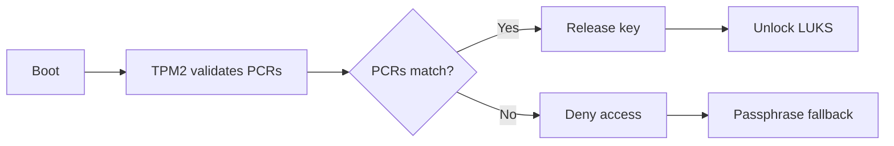
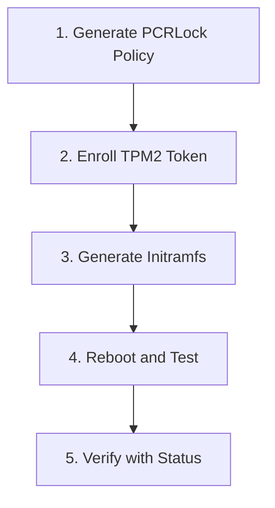
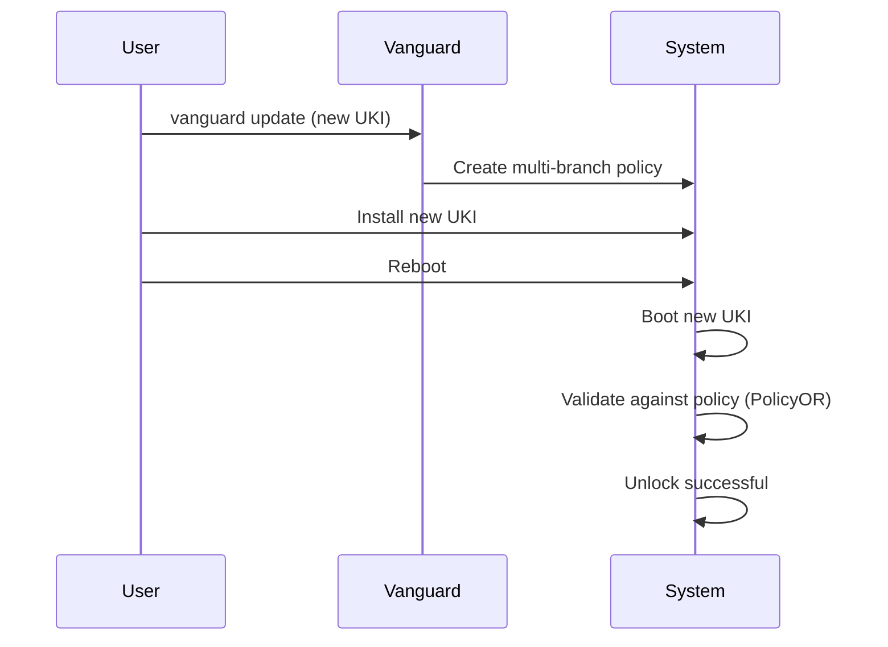

# TPM2 Setup Guide

This guide covers setting up TPM2-based automatic disk encryption unlocking with Vanguard.

## Overview

Vanguard uses a **native Go TPM2 stack** (`internal/tpm/`) for LUKS token unsealing. No external TPM tools are needed at runtime. The TPM chip stores the LUKS key sealed to Platform Configuration Register (PCR) values via PCRLock policy, ensuring the disk can only be unlocked when the system is in a known-good state.


```mermaid
flowchart LR
    A[Boot] --> B[TPM2 validates PCRs]
    B --> C{PCRs match?}
    C -->|Yes| D[Release key]
    C -->|No| E[Deny access]
    D --> F[Unlock LUKS]
    E --> G[Passphrase fallback]
```

## Prerequisites

### Required Packages
- `systemd` (version 251+)
- `tpm2-tss`
- `systemd-pcrlock` (at `/lib/systemd/systemd-pcrlock` or `/usr/lib/systemd/systemd-pcrlock`)

### System Requirements
- TPM 2.0 chip (hardware or firmware-based)
- UEFI Secure Boot (recommended)
- LUKS2 encrypted partition

### Verify TPM is Available

```bash
# Check for TPM device
ls -la /dev/tpm*

# Expected output:
# crw-rw---- 1 root root 10, 224 /dev/tpm0
# crw-rw---- 1 root root 253, 65536 /dev/tpmrm0

# Check TPM capabilities
tpm2_getcap properties-fixed
```

## PCRLock Policy

PCRLock provides fine-grained control over which boot measurements are validated using **predicted values** rather than current values. Vanguard's policy creates **multi-branch PCR predictions** (PolicyOR) where multiple PCR values are accepted, enabling firmware variation handling.

### Understanding PCRs

| PCR | Contents | Enforced | Notes |
|-----|----------|:--------:|-------|
| 2 | External code | ✓ Enforced (2 branches) | Option ROMs |
| 3 | External config | ✓ Enforced (2 branches) | |
| 4 | Boot loader code (UKI) | ✓ Enforced (up to 3 branches) | Multi-branch handles firmware variance |
| 5 | GPT partition table | Optional (`-l` flag) | Auto-enabled with `--luks-device` |
| 7 | Secure Boot state | ✓ Enforced (up to 2 branches) | Primary security PCR |
| 11 | LUKS header | Optional (`-l` flag) | Auto-enabled with `--luks-device`; measures LUKS2 header hash |
| 13 | sysexts | - Unbound (all-zeros) | |
| 14 | shim-policy | - Unbound (all-zeros) | |

**Unbound PCRs** (13, 14) appear in the policy as all-zeros because no measurements are made. They don't affect unlock - they're placeholders.

### PCR 4 Multi-Branch Prediction

PCR 4 (boot-loader-code) uses **PolicyOR** with up to 3 predicted values covering firmware event variations:

1. **`pe.pcrlock`** - `lock-pe` measurement of the UKI file (most reliable for PCR 4 when sd-stub uses LoadImage)
2. **`uki.pcrlock`** - `lock-uki` measurement (includes PCR 11 measurements; may fail on some systems, treated as fallback)
3. **`eventlog.pcrlock`** - Last `EV_EFI_BOOT_SERVICES_APPLICATION` event extracted from the current boot's CEL event log. This ensures the currently-booted kernel is recognized even if the file on disk has been replaced.

This means PCR 4 won't prevent unlock unless the UKI itself has been tampered with - legitimate firmware variations are handled by the multi-branch policy.

### Secure Boot (PCR 7)

PCR 7 is the most security-critical PCR. It measures the Secure Boot state:

- `0x8E09...` = Secure Boot enabled with valid signed boot chain
- `0x940A...` = Alternative valid state (varies by firmware)

**Without PCR 7 in the policy, a compromised Secure Boot state would still allow disk unlock.** Run `vanguard status` to verify PCR 7 is present and matching.

### GPT Partition Table Binding (PCR 5)

When `--luks-device` (`-l`) is specified, Vanguard automatically enables GPT partition table binding:

**Benefits:**
- Validates correct disk identity (partition layout + GUIDs)
- Prevents attacks using a different disk with same UKI

**Caveats:** Partition changes break unlock - re-run `vanguard update -l <device>` after.

### LUKS Header Binding (PCR 11)

When `--luks-device` (`-l`) is specified, Vanguard automatically enables LUKS header binding in addition to GPT binding:

**How it works:**
1. During `vanguard update`, the LUKS2 header (binary header + JSON metadata area) is hashed with SHA256 and a `.pcrlock` component directory (`755-vanguard-luks-header.pcrlock.d/`) is created with two variant files: `luks-header.pcrlock` (current on-disk header hash, matches the next boot) and `luks-header-eventlog.pcrlock` (previous boot's hash, lets make-policy validate the current event log).
2. During boot, vanguard's init hashes the LUKS2 header **before** attempting unlock and extends PCR 11 with the hash. A CEL-JSON record is written to `/run/log/systemd/tpm2-measure.log` so `systemd-pcrlock make-policy` can match the measurement.
3. The pcrlock policy predicts the PCR 11 value after the extension. If the header matches, unseal succeeds. If the header was tampered, PCR 11 won't match and unseal fails.

**Benefits:**
- Detects LUKS header tampering (e.g., attacker adds a keyslot, modifies cipher parameters)
- Prevents offline attacks that modify the header to weaken encryption
- Binds the disk encryption state to the TPM policy

**Status semantics (important):** the policy's PCR 11 value is an *at-unseal-time* prediction (sd-stub kernel measurement + LUKS header hash). After the disk is unlocked, systemd extends PCR 11 further (sysinit/ready phases), so the **live PCR 11 value in a booted system legitimately diverges from the policy** and always reports as a live mismatch. This is expected, not tampering. `vanguard status` therefore verifies the actual security property — the on-disk header digest against the enrollment-time component digests in `/etc/pcrlock.d/755-vanguard-luks-header.pcrlock.d/` — and reports CRITICAL only when the header itself changed. The PCR DETAILS table shows both the header digest comparison and the live PCR 11 value (annotated with post-unlock extensions).

**Caveats:**
- LUKS header changes (adding/removing keyslots, re-encrypting) break unlock - re-run `vanguard update -l <device>` after.
- Use `--no-luks-header` to disable LUKS header binding if needed.
- The measurement is read-only: vanguard never writes to the LUKS device during measurement.

## Setup Workflow


```mermaid
flowchart TD
    A[1. Generate PCRLock Policy] --> B[2. Enroll TPM2 Token]
    B --> C[3. Generate Initramfs]
    C --> D[4. Reboot and Test]
    D --> E[5. Verify with Status]
```

### Step 1: Generate PCRLock Policy

```bash
# Basic policy (PCRs 2, 3, 4, 7)
sudo vanguard update -u /boot/EFI/Gentoo/kernel.efi

# With GPT + LUKS header binding (adds PCR 5 + PCR 11)
sudo vanguard update -u /boot/EFI/Gentoo/kernel.efi -l /dev/nvme0n1p2

# Using a config file (reads uki_path and luks_device from /etc/vanguard.toml)
sudo vanguard update --config /etc/vanguard.toml

# With GPT binding but without LUKS header binding
sudo vanguard update -u /boot/EFI/Gentoo/kernel.efi -l /dev/nvme0n1p2 --no-luks-header

# With old NV index cleanup
sudo vanguard update -u /boot/EFI/Gentoo/kernel.efi -l /dev/nvme0n1p2 -c
```

This creates `<uki-path>.pcrlock.json` (e.g., `/boot/EFI/Gentoo/kernel.pcrlock.json`).

### Step 2: Enroll TPM2 Token

```bash
sudo systemd-cryptenroll --wipe-slot=tpm2 --tpm2-device=auto \
  --tpm2-with-pin=yes \
  --tpm2-pcrlock=/boot/EFI/Gentoo/kernel.pcrlock.json \
  /dev/nvme0n1p2
```

### Step 3: Generate Initramfs

```bash
sudo vanguard generate -o /boot/initramfs-linux.img
```

### Step 4: Reboot and Test

```bash
sudo reboot
```

### Step 5: Verify Status

```bash
sudo vanguard status
```

Expected output:
```
  PROTECTION TIER   ████████████████  HIGH

  THREAT MODEL

  ✓ Evil Maid (initrd/UKI replacement)
    Secure Boot:                 ✓ enabled, custom keys
    PCRLock PCR 7:               ✓ bound
    Platform Fused:              ✓ locked (production part)
    Hardware Validated Boot:     - not enabled (PHYSICAL→HIGH)
    sbctl: booted UKI signed:    ✓ kernel.efi

  ✓ Boot Chain Tampering (firmware/UKI change)
    PCRLock PCR binding:         ✓ 4 PCRs bound, all match
    PCRLock NV index:            ✓ 0x1a97310 present on TPM
    PCR0 Reconstruction:         ✓ valid
    PCRLock PCR 11 (LUKS header): ✓ bound — LUKS header unchanged since enrollment

  ✓ TPM Key Extraction (bus sniffing)
    TPM 2.0:                     ✓ /dev/tpmrm0
    TPM type:                    ✓ fTPM (CRB) - no external bus
    TPM bus encryption:          ✓ CONFIG_TCG_TPM2_HMAC active
    Dictionary attack lockout:   ✓ 3/3 remaining

  ⚠ Cold Boot Attack (RAM dump)
    Memory encryption:           ⚠ AMD SME available, not enabled

  ✓ Brute-Force / Key Theft (LUKS)
    TPM2 token:                  ✓ systemd-tpm2 enrolled
    PIN:                         ✓ additional auth factor
    HOTP fallback:               ✓ recovery code enrolled
```

Note: PCR 11 (LUKS header) is reported from the on-disk header digest
comparison, not the live PCR value — the live PCR 11 legitimately diverges
from the policy after unlock (see the LUKS header binding section above).

## Native Go TPM Stack

Vanguard's init binary uses **zero external TPM dependencies** at runtime:

| Component | Implementation |
|-----------|---------------|
| TPM communication | `google/go-tpm` via `tpmdirect` API |
| Sealed key unseal | Native PolicyPCR + PolicyAuthorizeNV (pcrlock) |
| PIN derivation | PBKDF2-HMAC-SHA256 with salt from LUKS token |
| SRK management | Transient creation, persistent handle, or tpm2_srk data |
| LUKS unlock | Native Go LUKS v1/v2 (`internal/luks/`) - no libcryptsetup |

All crypto is handled in-process. The only binaries included in the initramfs are `lvm`, `systemd-udevd`/`udevadm`, and `dmsetup`.

## Verify Policy

Verify the TPM, NV index, and LUKS token are synchronized:

```bash
# Basic verification (NV Index + PCR values)
sudo vanguard verify -p /boot/EFI/Gentoo/kernel.pcrlock.json

# With LUKS token validation
sudo vanguard verify -p /boot/EFI/Gentoo/kernel.pcrlock.json -l /dev/nvme0n1p2
```

Three checks run:
1. **NV Index sync** - TPM NV index auth policy + size match policy file
2. **PCR validation** - Current PCR values against policy expectations
3. **LUKS token** (with `-l`) - Token references correct NV index + enforces pcrlock

## Updating Kernel/UKI

When updating the kernel, update the PCRLock policy **before** booting the new kernel:


```mermaid
sequenceDiagram
    participant User
    participant Vanguard
    participant System
    
    User->>Vanguard: vanguard update (new UKI)
    Vanguard->>System: Create multi-branch policy
    User->>System: Install new UKI
    User->>System: Reboot
    System->>System: Boot new UKI
    System->>System: Validate against policy (PolicyOR)
    System->>System: Unlock successful
```

### Update Workflow

```bash
# 1. Update policy BEFORE installing new kernel
sudo vanguard update -u /boot/EFI/Gentoo/kernel.efi -l /dev/nvme0n1p2

# 2. Re-enroll token with updated policy
sudo systemd-cryptenroll --wipe-slot=tpm2 --tpm2-device=auto \
  --tpm2-with-pin=yes \
  --tpm2-pcrlock=/boot/EFI/Gentoo/kernel.pcrlock.json \
  /dev/nvme0n1p2

# 3. Install the new kernel/UKI
# (distribution-specific commands)

# 4. Verify
sudo vanguard status

# 5. Reboot
sudo reboot
```

Vanguard creates up to 3 predicted values for PCR 4, so the old kernel can still unlock the disk until the new kernel is booted.

## NV Index Cleanup

When `--cleanup` (`-c`) is specified, old unused pcrlock NV indices are removed from the TPM:

```bash
sudo vanguard update -u /boot/EFI/Gentoo/kernel.efi -l /dev/nvme0n1p2 -c
```

Vanguard keeps the current policy NV index and the LUKS token's NV index, removing everything else in the pcrlock range (`0x01800000`–`0x01BFFFFF`).

## Troubleshooting

### TPM Unlock Fails - PCR Mismatch

**Symptom:** Boot falls back to passphrase with TPM errors.

**Debug:** With debug mode (`-d`), Vanguard logs PCRs and current values to the boot log at `/boot/.vanguard.log`.

**Solution:**
```bash
# Check current status
sudo vanguard status

# Regenerate policy and re-enroll
sudo vanguard update -u /boot/EFI/Gentoo/kernel.efi -l /dev/nvme0n1p2
sudo systemd-cryptenroll --wipe-slot=tpm2 --tpm2-device=auto \
  --tpm2-with-pin=yes \
  --tpm2-pcrlock=/boot/EFI/Gentoo/kernel.pcrlock.json \
  /dev/nvme0n1p2
```

### "PCR 7 missing from policy" - Stale Firmware Components

**Symptom:** `vanguard update` fails with `policy verification failed: PCR 7 missing from policy`. Verbose output shows `No PCRs kept in protection mask` or `PCR 0 event log contains unrecognized measurements`.

**Root cause:** The auto-generated firmware component files in `/var/lib/pcrlock.d/` (e.g. `250-firmware-code-early.pcrlock.d/generated.pcrlock`) are stale - they were generated from a previous boot or firmware version and their digests no longer match the current event log. When `systemd-pcrlock make-policy` can't match a component, it drops the PCR from the protection mask. Since PCR 0/1 are at the root of the component dependency chain, dropping them cascades to drop ALL PCRs - including PCR 7.

**Fix:** Vanguard automatically regenerates firmware components before `make-policy` by running `systemd-pcrlock lock-firmware-code` and `lock-firmware-config` (or the Varlink `Lock` method on systemd 262+). If this still fails:

```bash
# Check the component file age
ls -la /var/lib/pcrlock.d/250-firmware-code-early.pcrlock.d/generated.pcrlock

# Manually regenerate firmware components
sudo systemd-pcrlock lock-firmware-code
sudo systemd-pcrlock lock-firmware-config

# Re-run vanguard update
sudo vanguard update -u /boot/EFI/Gentoo/kernel.efi -l /dev/nvme0n1p2 -v
```

### "PCR 0 touched by component we can't find" - Unmasked OS Separator

**Symptom:** Verbose output shows `PCR 0 is touched by component we can't find in event log` even after firmware component regeneration.

**Root cause:** systemd-pcrlock's `750-os-separator.pcrlock` and `770-nvpcr-separator.pcrlock` components expect systemd's userspace PCR measurements (EV_SEPARATOR events). Vanguard's custom init does not extend these PCRs, so the components can never match. When a component can't match, `systemd-pcrlock` drops every PCR it touches (0–7, 9, 12–14), cascading to drop ALL PCRs.

**Fix:** Vanguard masks these components (symlinks to `/dev/null` in `/etc/pcrlock.d/`). This is handled automatically by `ConfigureMasks()` during `vanguard update`. If the masks are missing:

```bash
# Check that masks exist
ls -la /etc/pcrlock.d/750-os-separator.pcrlock /etc/pcrlock.d/770-nvpcr-separator.pcrlock
# Both should be symlinks to /dev/null

# Re-run vanguard update to recreate masks
sudo vanguard update -u /boot/EFI/Gentoo/kernel.efi -l /dev/nvme0n1p2 -v
```

### TPM Device Not Found

**Symptom:** TPM not available, boot uses passphrase.

### "PCR 11 missing from policy" - LUKS Header Component Not Matching

**Symptom:** `vanguard update` succeeds but PCR 11 is not in the policy, or verbose output shows `PCR 11 is touched by component we can't find in event log`.

**Root cause:** The `755-vanguard-luks-header.pcrlock` component expects a PCR 11 extension from the LUKS header measurement, but the event log (`/run/log/systemd/tpm2-measure.log`) doesn't contain a matching record. This can happen if:

1. The initrd didn't write the event log record (e.g., TPM was unavailable during boot)
2. The LUKS header changed since the last `vanguard update` (stale `.pcrlock` component)
3. `systemd-pcrlock make-policy` can't match the component against the event log

**Fix:**

```bash
# Check if the component file exists
ls -la /etc/pcrlock.d/755-vanguard-luks-header.pcrlock.d/luks-header.pcrlock

# Re-run vanguard update to regenerate the component with the current header
sudo vanguard update -u /boot/EFI/Gentoo/kernel.efi -l /dev/nvme0n1p2 -v

# If PCR 11 still doesn't appear, check if the event log has the record
# (run after boot, before vanguard update)
cat /run/log/systemd/tpm2-measure.log | python3 -c "
import sys, json
for line in sys.stdin.read().split('\x1e'):
    line = line.strip()
    if not line: continue
    obj = json.loads(line)
    if obj.get('pcr') == 11:
        print(json.dumps(obj, indent=2))
"

# If no PCR 11 record, the initrd may not have measured the header
# Check vanguard debug output (generate the initramfs with -d) for "luks: measured LUKS2 header"
```

### TPM Device Not Found

**Check:**
```bash
lsmod | grep tpm     # Should show tpm_crb, tpm_tis, tpm_tis_core
ls -la /dev/tpm*     # Should show /dev/tpm0 and /dev/tpmrm0
```

Vanguard loads `tpm_crb`, `tpm_tis`, and `tpm_tis_core` modules automatically.

### PIN Prompt Fails

**Symptom:** Incorrect PIN errors, lockout.

**Check:** TPM lockout status with `vanguard status`.

**Solution:** Wait for lockout recovery period (shown in boot TUI), then re-enter correct PIN.

## Firmware Updates and fwupd Coexistence

### How fwupd interacts with pcrlock

[fwupd](https://fwupd.org/) 2.1.7+ includes a `systemd-pcrlock` plugin that coordinates with `systemd-pcrlock` to prevent disk lockout after firmware or SecureBoot updates. The plugin uses the `io.systemd.PCRLock` Varlink interface (requires systemd 262+).

**Before a firmware update**, fwupd:
1. Calls `io.systemd.PCRLock.Lock{category, lock=false}` for affected categories (firmwareCode, firmwareConfig, secureBootPolicy, secureBootAuthority)
2. Calls `io.systemd.PCRLock.MakePolicy` to regenerate systemd's policy without the removed measurements
3. Applies the firmware update
4. Reboots

**After reboot**, systemd's `systemd-pcrlock-secureboot-policy.service` and related units re-lock the policy against the new measurements.

### Vanguard's separate policy

Vanguard uses its own pcrlock policy at `/boot/EFI/Gentoo/kernel.pcrlock.json` with a separate TPM NV index. fwupd's plugin only regenerates systemd's policy at `/var/lib/systemd/pcrlock.json` - it does **not** touch vanguard's policy.

With the `vanguard-pcrlock-relock.service` enabled (see [Automatic re-lock after firmware update](#automatic-re-lock-after-firmware-update)), vanguard's policy and recovery seed are re-provisioned automatically after reboot. The manual steps below are only needed if the service is not enabled:

```bash
# MANUAL FALLBACK - only if vanguard-pcrlock-relock.service is not enabled:
# After fwupd applies the update but BEFORE rebooting:
sudo vanguard update -u /boot/EFI/Gentoo/kernel.efi -l /dev/nvme0n1p2

# Re-enroll the LUKS token with the new policy
sudo systemd-cryptenroll --wipe-slot=tpm2 --tpm2-device=auto \
  --tpm2-with-pin=yes \
  --tpm2-pcrlock=/boot/EFI/Gentoo/kernel.pcrlock.json \
  /dev/nvme0n1p2

# If Secure Boot keys changed, re-provision the recovery seed:
sudo vanguard recovery --auto-reseed

# Now it's safe to reboot
sudo reboot
```

### Varlink interface (systemd 262+)

On systemd 262+, vanguard uses the `io.systemd.PCRLock` Varlink interface instead of shelling out to the `systemd-pcrlock` CLI for the following operations:

| Operation | Varlink method | CLI fallback |
|-----------|---------------|-------------|
| Lock Secure Boot policy | `Lock{secureBootPolicy, lock=true}` | `lock-secureboot-policy` |
| Lock Secure Boot authority | `Lock{secureBootAuthority, lock=true}` | `lock-secureboot-authority` |
| Regenerate firmware code | `Lock{firmwareCode, lock=true}` | `lock-firmware-code` |
| Regenerate firmware config | `Lock{firmwareConfig, lock=true}` | `lock-firmware-config` |

Vanguard automatically detects whether the Varlink interface is available (by introspecting the socket at `/run/systemd/io.systemd.PCRLock` for the `Lock` method). If unavailable, it falls back to the CLI path. No configuration needed.

The `make-policy` step always uses the CLI path because:
1. The Varlink `MakePolicy` method writes to systemd's default policy path (`/var/lib/systemd/pcrlock.json`), not vanguard's policy path
2. Vanguard needs an interactive recovery PIN prompt (`--recovery-pin=query`), while the Varlink method only supports `RECOVERY_PIN_HIDE` mode

### Automatic re-lock after firmware update

Vanguard ships a systemd unit that automatically re-locks the pcrlock policy **and** re-provisions the HOTP recovery seed after a firmware update that changes Secure Boot keys (PCR 7).

**Prerequisite:** Add `uki_path` and `luks_device` to your `/etc/vanguard.toml`:

```toml
# /etc/vanguard.toml
uki_path = "/boot/EFI/Gentoo/kernel.efi"
luks_device = "/dev/nvme0n1p2"
```

**Installation:**

```bash
# Install the binary to /usr/bin/vanguard and the unit to the systemd
# directory (the unit's ExecStart requires /usr/bin/vanguard — a binary
# installed elsewhere, e.g. /usr/local/bin, makes the service fail with
# 203/EXEC):
sudo make install-systemd

# Enable the service
sudo systemctl enable vanguard-pcrlock-relock.service
```

**What it does after reboot:**

1. `vanguard update --config /etc/vanguard.toml --no-verify` - regenerates the pcrlock policy against the new firmware measurements (reads `uki_path` and `luks_device` from the TOML config)
2. `vanguard recovery --auto-reseed` - detects if the recovery seed is unreadable (PCR 7 changed), generates a new seed, and writes it to TPM NVRAM. The new seed's `otpauth://` URI is saved to `/var/lib/vanguard/recovery-pending.uri`.

**After the service runs:**

Retrieve the new HOTP seed and re-enroll your authenticator app:

```bash
sudo vanguard recovery --show
```

This reads the pending file, displays the QR code, and on successful HOTP verification deletes the pending file.

**Failure handling:** If `--auto-reseed` fails (e.g., TPM error), the service logs a warning but does not block boot. The recovery seed is a fallback - if it's unavailable, the user can manually run `vanguard recovery --clean --enable`.

## TPM NVRAM Index Allocation

Vanguard and systemd-pcrlock use TPM2 NVRAM indexes in the owner hierarchy range. The following table documents all index ranges:

| Index Range | Purpose | Owner | Size | Notes |
|---|---|---|---|---|
| `0x01800000`–`0x01BFFFFF` | systemd-pcrlock policy indexes | systemd-pcrlock | 34 bytes (SHA256 digest + 2B header) | Auto-discovered by `FindPCRLockNVIndex` |
| `0x01C20000` | Default pcrlock NV index (fallback) | systemd-pcrlock | 34 bytes | Used when token doesn't pin a specific index |
| **`0x01C30001`** | **Vanguard HOTP recovery seed** | **vanguard** | **32 bytes** | PCR-bound (PolicyRead/PolicyWrite); only accessible with correct PCR 7 state |
| **`0x01C30003`** | **Vanguard HOTP recovery state** | **vanguard** | **12 bytes** | Owner-auth (not secret); 8-byte counter + 4-byte fail count. Persists the one-time-code position across boots |
| `0x01C30004`–`0x01C3FFFF` | Reserved for future vanguard indexes | vanguard | - | Not yet used |

### Recovery NV Index Details

The HOTP recovery uses two separate NV indexes:

**Seed index (`0x01C30001`):**
- Attributes: `PolicyRead`, `PolicyWrite`, `NoDA`, `WriteAll`, `NT=Ordinary`
- No `OwnerRead`/`OwnerWrite` - owner auth alone cannot read or write the seed
- No `PolicyDelete` - owner auth can undefine the index (DoS only, not secret extraction)
- `authPolicy` = `PolicyPCR(PCR 7)` - single branch: Secure Boot state. The seed is only released when PCR 7 matches the enrollment-time value. No `PolicyOR` is used (the TPM requires at least 2 branches for `PolicyOR`).
- Reading/writing requires a policy session with `PolicyPCR` matching the `authPolicy`
- Deletion uses `NVUndefineSpace` with owner auth (no policy session needed)
- **Anti-evil-maid protection**: An attacker booting from a live USB has different PCR values → cannot read the seed → cannot generate valid HOTP codes

**State index (`0x01C30003`):**
- Attributes: `PolicyRead`, `PolicyWrite`, `NoDA`, `WriteAll`, `NT=Ordinary`
- Bound to PCR 7 by the same `PolicyPCR` authPolicy as the seed — the counter is not a secret, but its integrity is: binding it to the boot state prevents counter/fail-count rollback from an untrusted boot
- Layout: 12 bytes total - 8-byte big-endian HOTP counter + 4-byte big-endian failed-attempt count
- The counter advances past the matched position after every successful code (consuming it), so codes cannot be replayed
- The fail count bounds cross-boot online guessing: at `10` failures recovery refuses further codes until a successful disk unlock resets it
- The state index is bound to PCR 7 by the same `PolicyPCR` as the seed: a live-USB boot can neither read nor reset the counter/fail count — the cap and the counter position cannot be rolled back off the trusted boot chain
- The legacy TOTP reference-timestamp index (`0x01C30002`) is no longer used

### Anti-Evil-Maid Protection

The HOTP seed is **PCR-bound** - it can only be read when the current PCR state matches the `authPolicy` stored in the NV index. This prevents an attacker with physical access from reading the seed via a live USB:

| Scenario | PCR state | Seed accessible? |
|----------|-----------|-----------------|
| Normal boot (genuine UKI + Secure Boot) | PCR 7 matches | Yes |
| After kernel update (PCR 4 changed) | PCR 7 unchanged | Yes |
| After firmware update (PCR 0 changed, Secure Boot keys stable) | PCR 7 unchanged | Yes |
| **After firmware update (Secure Boot keys reset)** | **PCR 7 changed** | **No - re-provision via `--auto-reseed`** |
| **Attacker boots from live USB** | **PCR 7 completely different** | **No** |
| **Attacker replaces initrd (EvilAbigail)** | **PCR 4 changed, Secure Boot off → PCR 7 changed** | **No** |
| **Secure Boot disabled** | **PCR 7 changes** | **No** |

The single-branch policy binds the seed to PCR 7 (Secure Boot configuration). The seed is only released when Secure Boot is active and matches the enrollment-time state. When Secure Boot keys change (e.g., firmware update resets PK/KEK/db), the seed becomes inaccessible and must be re-provisioned.

### Migration from 3-branch to single-branch policy

Previous vanguard versions used a 3-branch `PolicyOR` (`{4,7}`, `{7}`, `{0,7}`). The `authPolicy` hash changed when switching to the single-branch `PolicyPCR(PCR 7)` policy. If upgrading from a previous version, re-enroll the recovery seed:

```bash
sudo vanguard recovery --clean
sudo vanguard recovery --enable
```

If the `vanguard-pcrlock-relock.service` is enabled, `--auto-reseed` will handle this automatically on the next reboot (the old 3-branch seed will be unreadable, triggering re-provisioning).

### Migration from TOTP to HOTP

Recovery switched from TOTP (time-based) to HOTP (counter-based) because the initramfs has no trustworthy clock. A seed enrolled by an older vanguard has no state index, so the new code treats it as not HOTP-enrolled and refuses recovery until you re-enroll:

```bash
sudo vanguard recovery --enable
```

Then re-scan the new `otpauth://hotp` QR code with an HOTP-capable app (Aegis, FreeOTP, KeePassXC, Bitwarden, ...). Re-enroll promptly: until you do, a failed TPM unseal cannot use recovery.

## Recovery

### HOTP Recovery (Recommended)

HOTP recovery allows passphrase fallback in strict mode without weakening the security model. When the TPM2 unseal fails, the user enters an 8-digit HOTP code from their authenticator app. If correct, passphrase fallback is enabled for this boot only.

**Parameters:** HMAC-SHA256, counter-based (RFC 4226), 8 digits, lookahead window of 4 counters. No clock is consulted — recovery works with a dead RTC or wrong system time.

#### Enable HOTP Recovery

```bash
sudo vanguard recovery --enable
```

This generates a 32-byte random HOTP seed, stores it in TPM NVRAM at index `0x01C30001` (PCR-bound with anti-evil-maid protection), and displays:
- A QR code for scanning with an HOTP-capable authenticator app (Aegis, FreeOTP, KeePassXC, Bitwarden, ...)
- The base32-encoded seed for manual entry
- The `otpauth://` URI for enrollment

Register the QR code in your authenticator app. The seed persists in TPM NVRAM and survives reboots.

#### How HOTP Recovery Works at Boot

1. TPM2 unseal fails (e.g. after firmware update without re-running `vanguard update`)
2. Vanguard checks if HOTP recovery is configured (NV index `0x01C30001` exists)
3. If configured, prompts: "Enter recovery HOTP code (attempt N/3):"
4. User enters the 8-digit code from their authenticator app
5. Vanguard validates it (constant-time) against the stored counter and the next few counters (lookahead)
6. If correct → the counter advances past the matched position (the code is consumed) → passphrase fallback enabled for this boot
7. If the persisted failure count has reached the cap (15), recovery is locked until a successful disk unlock resets it

**No clock dependency:** HOTP is purely counter-based. A dead RTC, a firmware-reset clock, a wrong timezone, or a machine that was powered off for months all make no difference — there is no time base to get wrong.

#### Manage HOTP Recovery

```bash
# Show current seed and QR code (for re-enrollment)
sudo vanguard recovery --show

# Disable HOTP recovery (removes seed from TPM NVRAM)
sudo vanguard recovery --disable

# Print recovery instructions
vanguard recovery
```

#### Security Properties

| Property | How |
|----------|-----|
| Can't be triggered via kernel cmdline | `vanguard.strict=0` cmdline override has been removed entirely |
| Can't replay old codes | Each successful code advances the TPM-stored counter past it, so it can never be reused. Only codes within the small lookahead window (4) are accepted |
| Can't brute-force | 3 attempts per boot; the persisted fail count locks recovery after 10 total failures until a successful unlock. An 8-digit code with a lookahead of 4 gives ≈1.5×10⁻⁷ per boot, and the policy-bound persistent cap bounds the lifetime |
| Seed stored in TPM NVRAM | Not on disk; PCR-bound (anti-evil-maid); only readable with correct PCR 7 state |
| Anti-evil-maid | Attacker booting from live USB cannot read the seed (wrong PCR values) |
| Anti-EvilAbigail | Attacker replacing initrd changes PCR 4 → seed still readable if Secure Boot (PCR 7) unchanged, but initrd validation prevents unseal |
| Constant-time comparison | Uses `crypto/subtle.ConstantTimeCompare` to prevent timing attacks |

### Recovery PIN

When you run `vanguard update`, the `make-policy` step prompts for a recovery PIN. This PIN is sealed into the TPM alongside the PCR policy. If the PCR values change (e.g. after a firmware update without re-running `vanguard update`), the TPM will not unseal the key automatically - but the recovery PIN can be used to unseal it manually via `systemd-pcrlock recover`.

The recovery PIN is separate from the LUKS passphrase. It is stored in the TPM NV index, not on disk.

### Passphrase Fallback

In strict mode (default), passphrase fallback requires HOTP recovery. Without HOTP recovery configured, a failed TPM unlock will halt the system.

Always maintain a passphrase slot for emergency recovery:

```bash
# Add passphrase slot
sudo cryptsetup luksAddKey /dev/nvme0n1p2

# Verify slots exist
sudo cryptsetup luksDump /dev/nvme0n1p2 | grep "Key Slot"
```
